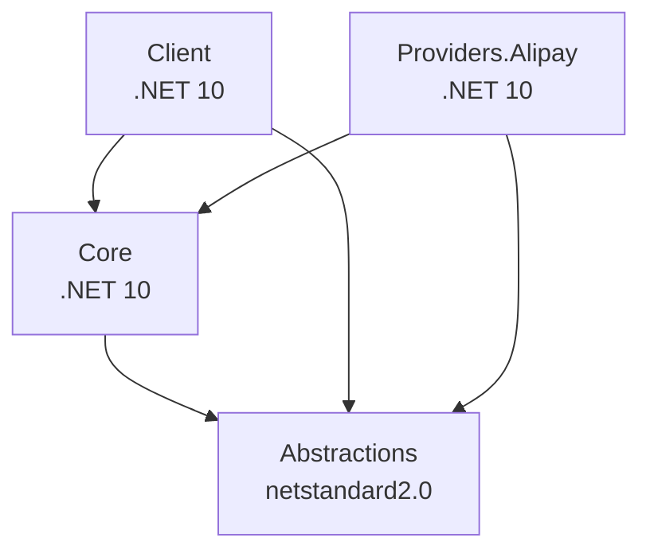

# 🚀 NexusContract NuGet Package Ecosystem

[**中文文档 / Chinese Documentation**](./PACKAGES.zh-CN.md)

## 📦 Package Overview

| Package | Version | Framework | Description |
|---------|---------|-----------|-------------|
| [NexusContract.Abstractions](https://www.nuget.org/packages/NexusContract.Abstractions) |  | netstandard2.0 | Core abstraction layer (zero dependencies) |
| [NexusContract.Core](https://www.nuget.org/packages/NexusContract.Core) |  | .NET 10 | Gateway engine and four-phase pipeline |
| [NexusContract.Client](https://www.nuget.org/packages/NexusContract.Client) |  | .NET 10 | Client SDK (HTTP communication for BFF/business layer) |
| [NexusContract.Providers.Alipay](https://www.nuget.org/packages/NexusContract.Providers.Alipay) |  | .NET 10 | Alipay provider (OpenAPI v3) |

## ✨ Features

### 🤖 AI-Friendly Design

- **Self-Describing Metadata**: Every package contains detailed Description and PackageTags
- **Complete XML Documentation**: All public APIs have XML comments for AI comprehension
- **Embedded README**: NuGet packages include complete documentation
- **SourceLink Support**: Debug directly into GitHub source code

### 📚 Developer-Friendly

```bash
# Quick Start
dotnet add package NexusContract.Abstractions
dotnet add package NexusContract.Core

# Alipay Integration
dotnet add package NexusContract.Providers.Alipay
```

### 🔍 Debugging Experience

All packages include:
- ✅ **Symbol packages (.snupkg)** - Breakpoint debugging support
- ✅ **SourceLink** - Automatic link to GitHub source code
- ✅ **Embedded sources** - View source even offline

## 🏗️ Architecture

```
┌──────────────────────────────────────────────┐
│   BFF / Business Layer (Layer 2)             │
│   └─ Uses: NexusGatewayClient (HTTP calls)    │
└──────────────────────────────────────────────┘
         ↓ HTTP (Client Package)
┌──────────────────────────────────────────────┐
│   HttpApi Layer (Layer 1)                    │
│   └─ FastEndpoints + Provider               │
└──────────────────────────────────────────────┘
         ↓ Direct Call (Provider Package)
┌──────────────────────────────────────────────┐
│   Provider Layer (Layer 0)                   │
│   └─ AlipayProvider (OpenAPI v3)            │
└──────────────────────────────────────────────┘
         ↓ calls
┌──────────────────────────────────────────────┐
│   Alipay OpenAPI                             │
└──────────────────────────────────────────────┘

OR (Direct Integration - Skip HttpApi)

┌──────────────────────────────────────────────┐
│   Your Application                           │
│   └─ AlipayProvider (Direct)                │
└──────────────────────────────────────────────┘
         ↓ calls
┌──────────────────────────────────────────────┐
│   Alipay OpenAPI                             │
└──────────────────────────────────────────────┘
```

## 📖 Quick Examples

### 1. Define Contract (Abstractions)

```csharp
using NexusContract.Abstractions;

[NexusContract(Method = "alipay.trade.query")]
public sealed class TradeQueryRequest
{
    [ContractProperty(Name = "out_trade_no", Order = 1)]
    public string? OutTradeNo { get; set; }

    [ContractProperty(Name = "trade_no", Order = 2)]
    public string? TradeNo { get; set; }
}
```

### 2. Configure Engine (Core + Provider)

```csharp
using NexusContract.Core;
using NexusContract.Providers.Alipay;

var gateway = new NexusGateway();
gateway.RegisterProvider(new AlipayProvider(
    appId: "2021...",
    merchantPrivateKey: "MII...",
    alipayPublicKey: "MII..."
));

// Startup health check (recommended)
var diagnostics = gateway.PreloadMetadata();
if (!diagnostics.IsHealthy)
{
    foreach (var error in diagnostics.Errors)
        Console.WriteLine($"❌ {error}");
    Environment.Exit(1);
}
```

### 3. Execute Requests (Three-Layer Architecture)

#### Layer 1: HttpApi (FastEndpoints + Provider)

```csharp
// 🎯 Inside HttpApi: Zero-code endpoint, direct Provider call
public sealed class TradeQueryEndpoint(AlipayProvider provider) 
    : AlipayEndpointBase<TradeQueryRequest>(provider) { }
// ✅ Route auto-inferred as POST /trade/query
// ✅ Direct Provider call, no HTTP overhead
```

#### Layer 2: BFF/Business Layer (Client via HTTP)

```csharp
// 🎯 BFF or business service: HTTP call to HttpApi endpoint
using NexusContract.Client;

var httpClient = new HttpClient 
{ 
    BaseAddress = new Uri("https://payment-api.example.com") 
};
var client = new NexusGatewayClient(httpClient, new SnakeCaseNamingPolicy());

// ✅ Sends HTTP request to HttpApi's /trade/query endpoint
// ✅ URL auto-extracted from [ApiOperation]
var response = await client.SendAsync(
    new TradeQueryRequest { TradeNo = "202501..." }
);
```

#### Layer 3: Direct Integration (Provider Only, No HttpApi)

```csharp
// 🎯 Direct integration: Skip HttpApi, call Alipay OpenAPI directly
using NexusContract.Providers.Alipay;

var provider = new AlipayProvider(appId, privateKey, publicKey);

// ✅ Direct Alipay OpenAPI call, no HTTP intermediary
// ✅ Method auto-extracted from [NexusContract]
var response = await provider.ExecuteAsync(
    new TradeQueryRequest { TradeNo = "202501..." }
);
```

**Architecture Selection Guide:**

| Scenario | Recommended Solution | Components |
|----------|---------------------|------------|
| Microservices architecture, unified payment gateway API | Layer 1 + Layer 2 | HttpApi (FastEndpoints) + Client (BFF) |
| Monolithic application, direct payment integration | Layer 3 (Direct) | Provider only |
| Multi-tenant SaaS, centralized payment service | Layer 1 + Layer 2 | HttpApi + Client |

## 🔧 Publishing Workflow

### Local Publishing

```powershell
# Build and pack
.\pack.ps1 -Version "1.0.0-preview.1"

# Publish to NuGet.org
.\pack.ps1 -Version "1.0.0-preview.1" -Publish -ApiKey "your-api-key"
```

### Automated Publishing (GitHub Actions)

```bash
# Create version tag to trigger CI/CD
git tag -a v1.0.0-preview.1 -m "Release 1.0.0-preview.1"
git push origin v1.0.0-preview.1
```

See [NUGET_PUBLISHING.md](./docs/NUGET_PUBLISHING.md) for detailed steps.

## 📊 Package Dependencies



## 🎯 Version Strategy

- `1.0.0-preview.x` - Current preview releases
- `1.0.0-rc.x` - Release candidates
- `1.0.0` - Stable release (planned)

See [Semantic Versioning](https://semver.org/)

## 🔐 Security & Trust

- ✅ **MIT License** - Business-friendly
- ✅ **SourceLink Verified** - Auditable source code
- ✅ **Deterministic Builds** - Reproducible builds
- ✅ **Symbol Package Support** - Optimized debugging experience

## 📚 Documentation Index

- [README.md](./README.md) - Project overview
- [IMPLEMENTATION.md](./docs/IMPLEMENTATION.md) - Implementation guide
- [NUGET_PUBLISHING.md](./docs/NUGET_PUBLISHING.md) - Publishing guide
- [CLIENT_SDK_GUIDE.md](./src/NexusContract.Client/CLIENT_SDK_GUIDE.md) - Client SDK documentation

## 🤝 Contributing

Contributions are welcome! Please read [CONTRIBUTING.md](./CONTRIBUTING.md) (planned).

## 📄 License

MIT License - See [LICENSE](./LICENSE)

---

**Maintainer:** NexusContract  
**Project Homepage:** https://github.com/NexusContract/PubSoft.NexusContract  
**NuGet Profile:** https://www.nuget.org/profiles/NexusContract
