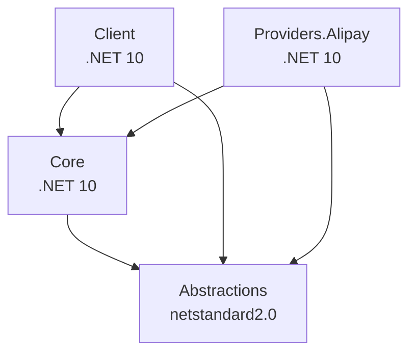

# 🚀 NexusContract NuGet 包体系

## 📦 包概览

| 包名 | 版本 | 框架 | 描述 |
|------|------|------|------|
| [NexusContract.Abstractions](https://www.nuget.org/packages/NexusContract.Abstractions) |  | netstandard2.0 | 宪法级契约和属性（零依赖） |
| [NexusContract.Core](https://www.nuget.org/packages/NexusContract.Core) |  | .NET 10 | 网关引擎、四阶段管道和启动诊断 |
| [NexusContract.Client](https://www.nuget.org/packages/NexusContract.Client) |  | .NET 10 | BFF/业务层的 HTTP 客户端 SDK |
| [NexusContract.Providers.Alipay](https://www.nuget.org/packages/NexusContract.Providers.Alipay) |  | .NET 10 | 支付宝提供商（OpenAPI v3） |

## ✨ 特性

### 🤖 AI 友好设计

- **自解释元数据**: 每个包都包含详细的 Description 和 PackageTags
- **完整 XML 文档**: 所有公共 API 都有 XML 注释，便于 AI 理解
- **嵌入式 README**: NuGet 包内嵌完整说明文档
- **SourceLink 支持**: 调试时可直接跳转到 GitHub 源码

### 📚 开发者友好

```bash
# 快速开始
dotnet add package NexusContract.Abstractions
dotnet add package NexusContract.Core

# 支付宝集成
dotnet add package NexusContract.Providers.Alipay
```

### 🔍 调试体验

所有包都包含:
- ✅ **符号包 (.snupkg)** - 断点调试支持
- ✅ **SourceLink** - 自动链接到 GitHub 源码
- ✅ **嵌入式源码** - 即使离线也能查看

## 🏗️ 架构

```
┌──────────────────────────────────────────────┐
│   BFF / Business Layer (Layer 2)             │
│   └─ Uses: NexusGatewayClient (HTTP calls)    │
└──────────────────────────────────────────────┘
         ↓ HTTP (Client Package)
┌──────────────────────────────────────────────┐
│   HttpApi Layer (Layer 1)                    │
│   └─ FastEndpoints + Provider               │
└──────────────────────────────────────────────┘
         ↓ Direct Call (Provider Package)
┌──────────────────────────────────────────────┐
│   Provider Layer (Layer 0)                   │
│   └─ AlipayProvider (OpenAPI v3)            │
└──────────────────────────────────────────────┘
         ↓ calls
┌──────────────────────────────────────────────┐
│   Alipay OpenAPI                             │
└──────────────────────────────────────────────┘

OR (Direct Integration - Skip HttpApi)

┌──────────────────────────────────────────────┐
│   Your Application                           │
│   └─ AlipayProvider (Direct)                │
└──────────────────────────────────────────────┘
         ↓ calls
┌──────────────────────────────────────────────┐
│   Alipay OpenAPI                             │
└──────────────────────────────────────────────┘
```

## 📖 快速示例

### 1. 定义契约 (Abstractions)

```csharp
using NexusContract.Abstractions;

[NexusContract(Method = "alipay.trade.query")]
public sealed class TradeQueryRequest
{
    [ContractProperty(Name = "out_trade_no", Order = 1)]
    public string? OutTradeNo { get; set; }

    [ContractProperty(Name = "trade_no", Order = 2)]
    public string? TradeNo { get; set; }
}
```

### 2. 配置引擎 (Core + Provider)

```csharp
using NexusContract.Core;
using NexusContract.Providers.Alipay;

var gateway = new NexusGateway();
gateway.RegisterProvider(new AlipayProvider(
    appId: "2021...",
    merchantPrivateKey: "MII...",
    alipayPublicKey: "MII..."
));

// 启动期体检（推荐）
var diagnostics = gateway.PreloadMetadata();
if (!diagnostics.IsHealthy)
{
    foreach (var error in diagnostics.Errors)
        Console.WriteLine($"❌ {error}");
    Environment.Exit(1);
}
```

### 3. 执行请求（三层架构）

#### Layer 1: HttpApi 层（使用 FastEndpoints + Provider）

```csharp
// 🎯 HttpApi 内部：零代码端点，直接调用 Provider
public sealed class TradeQueryEndpoint(AlipayProvider provider) 
    : AlipayEndpointBase<TradeQueryRequest>(provider) { }
// ✅ 路由自动推断为 POST /trade/query
// ✅ 直接调用 Provider，无 HTTP 开销
```

#### Layer 2: BFF/业务层（使用 Client 通过 HTTP 调用 HttpApi）

```csharp
// 🎯 BFF 或业务服务：通过 HTTP 调用 HttpApi 端点
using NexusContract.Client;

var httpClient = new HttpClient 
{ 
    BaseAddress = new Uri("https://payment-api.example.com") 
};
var client = new NexusGatewayClient(httpClient, new SnakeCaseNamingPolicy());

// ✅ 发送 HTTP 请求到 HttpApi 的 /trade/query 端点
// ✅ 自动从 [ApiOperation] 提取 URL
var response = await client.SendAsync(
    new TradeQueryRequest { TradeNo = "202501..." }
);
```

#### Layer 3: 直接集成（使用 Provider，无 HttpApi 中间层）

```csharp
// 🎯 直接集成：跳过 HttpApi，直接调用支付宝 OpenAPI
using NexusContract.Providers.Alipay;

var provider = new AlipayProvider(appId, privateKey, publicKey);

// ✅ 直接调用支付宝 OpenAPI，无 HTTP 中间层
// ✅ 自动从 [NexusContract] 提取方法
var response = await provider.ExecuteAsync(
    new TradeQueryRequest { TradeNo = "202501..." }
);
```

**架构选择指南：**

| 场景 | 推荐方案 | 组件 |
|------|---------|------|
| 微服务架构，统一支付网关 API | Layer 1 + Layer 2 | HttpApi (FastEndpoints) + Client (BFF) |
| 单体应用，直接集成支付 | Layer 3 | Provider only |
| 多租户 SaaS，集中式支付服务 | Layer 1 + Layer 2 | HttpApi + Client |

## 🔧 发布流程

### 本地发布

```powershell
# 构建和打包
.\pack.ps1 -Version "1.0.0-preview.1"

# 发布到 NuGet.org
.\pack.ps1 -Version "1.0.0-preview.1" -Publish -ApiKey "your-api-key"
```

### 自动化发布 (GitHub Actions)

```bash
# 创建版本标签触发 CI/CD
git tag -a v1.0.0-preview.1 -m "Release preview 1"
git push origin v1.0.0-preview.1
```

详细步骤见 [NUGET_PUBLISHING.md](./docs/NUGET_PUBLISHING.md)

## 📊 包依赖关系



## 🎯 版本策略

- `1.0.0-preview.x` - 当前预览版
- `1.0.0-rc.x` - Release Candidate
- `1.0.0` - 正式版（规划中）

详见 [语义化版本规范](https://semver.org/)

## 🔐 安全与信任

- ✅ **MIT 许可证** - 商业友好
- ✅ **SourceLink 验证** - 可审计源码
- ✅ **确定性构建** - 可重现构建
- ✅ **符号包支持** - 调试体验优化

## 📚 文档索引

- [README.md](./README.md) - 项目概览
- [IMPLEMENTATION.md](./docs/IMPLEMENTATION.md) - 实现指南
- [NUGET_PUBLISHING.md](./docs/NUGET_PUBLISHING.md) - 发布指南
- [CLIENT_SDK_GUIDE.md](./src/NexusContract.Client/CLIENT_SDK_GUIDE.md) - 客户端 SDK 文档

## 🤝 贡献

欢迎贡献！请阅读 [CONTRIBUTING.md](./CONTRIBUTING.md)（规划中）

## 📄 许可证

MIT License - 详见 [LICENSE](./LICENSE)

---

**维护者:** NexusContract  
**项目主页:** https://github.com/NexusContract/PubSoft.NexusContract  
**NuGet 主页:** https://www.nuget.org/profiles/pubsoft
