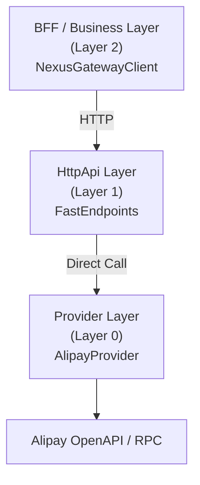
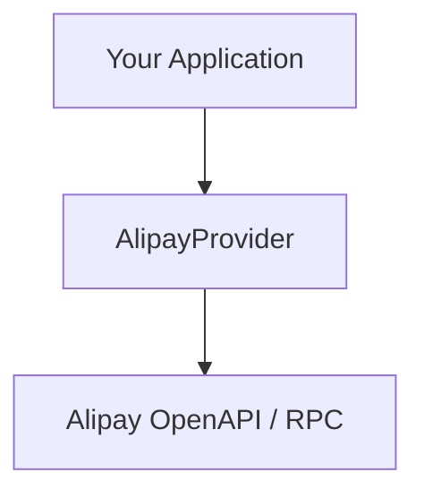

# NexusContract (Elite Edition)

> **English (Current)** | **[中文文档 (Chinese)](./README.zh-CN.md)**

**Kernelized Contract Integration (KCI) Framework**  
A deterministic, startup-validated **contract runtime** for payment and third-party integrations,  
built on **.NET Standard 2.0 + .NET 10**.

> **“Explicit boundaries over implicit magic.”**  
> This is not a slogan — it is the constitutional principle of NexusContract.

> ## 📐 Architecture Blueprint (v1.1 — ISV Multi‑Tenant)
> The full architecture blueprint is available at `docs/ARCHITECTURE_BLUEPRINT.md` (v1.1, 2026‑01‑10).  
> **Current codebase:** `v1.0.0‑preview.10` — core constitutional constraints are implemented (startup validation, zero reflection, deterministic execution). ISV extensions (JIT Resolver, Realm/Profile, YarpTransport) are being progressively implemented and validated in controlled environments.

All designs in this framework revolve around:

- **Determinism**
- **Observability**
- **Architectural Constraints**
- **Fail-Fast Correctness**

---

## 🧭 What Problem Does NexusContract Solve?

In real-world payment and third-party integrations:

- OpenAPI, RPC, and undocumented interfaces **coexist**
- The same business intent maps to **different physical protocols**
- A missing encrypted field name is **not a bug — it is a financial incident**
- Runtime validation is **already too late**

Most frameworks treat contracts as:

- DTOs
- Runtime configurations
- Flexible mappings

**NexusContract treats contracts as executable system constraints,
validated before the system is allowed to start.**

---

## 🏛️ Core Architecture: From REPR to REPR-P

NexusContract extends the **REPR (Request–Endpoint–Response)** pattern from  
[FastEndpoints](https://fast-endpoints.com/) by introducing **Proxying**, forming the **REPR-P** model.

### REPR-P Explained

- **R — Request**  
  Strongly-typed business intent  
  (`IApiRequest<TResponse>`)

- **E — Endpoint**  
  Zero-business-code proxy  
  Responsible only for protocol adaptation

- **R — Response**  
  Strongly-typed business result

- **P — Proxy**  
  `NexusGateway`  
  The orchestration kernel that executes the pipeline and routes calls to Providers

> Aim to prevent business logic from leaking into transport layers.
> Avoid embedding transport concerns in contracts; keep contracts focused on business semantics.
>
> **Note**: Violations should be detected before traffic is live where feasible; this improves safety but may require staged validation in complex deployments.

This separation helps ensure NexusContract remains usable in modular deployments.

---

## 🧭 Contract Is Constitutional, Not Configurable

In NexusContract, a contract is **not**:

- a DTO
- a runtime configuration
- a flexible mapping definition

It is a **constitutional artifact**.

### What This Means

- ❌ No silent fallback
- ❌ No runtime guessing
- ❌ No environment-specific overrides
- ✅ Either fully compliant — or the service **refuses to start**

### Why So Strict?

Because in payment systems:

- Encrypted fields **must** have explicit names
- Protocol projections **must** be deterministic
- Violations must be detected **before traffic exists**

In practice, this means:

- Contract validation is part of the application bootstrap phase
- Violations surface as startup failures, not runtime exceptions
- There is no supported mechanism to bypass or override contracts

> **All constitutional violations are detected at startup, in one panoramic scan.**

---

## 🚀 Core Features

### 🔒 Constitutional Startup Health Check

- One-time panoramic scan of all contracts
- Enforces architectural rules (nesting depth, encryption rules, naming)
- Fails fast **before** the service starts accepting traffic

### 🧠 Metadata-Driven, Runtime-Frozen

- All metadata is scanned and frozen at startup
- Zero reflection at runtime
- Near-zero allocation execution path

### 🔄 Four-Phase Execution Pipeline

All requests follow the same deterministic flow:

```

Validate → Project → Execute → Hydrate

````

No shortcuts. No hidden branches.

### 🧾 Structured Diagnostics (NXC Codes)

Every violation has a unique diagnostic code:

- Static (startup)
- Outbound (provider call)
- Inbound (response hydration)

Designed for **rapid localization**, not vague logs.

---

## 🏁 Quick Start: Startup Health Check

Example from `Demo.Alipay.HttpApi`:

```csharp
// 1. Scan all ApiOperation contracts
var types = AppDomain.CurrentDomain.GetAssemblies()
    .SelectMany(a => a.GetTypes())
    .Where(t => t.IsClass && !t.IsAbstract &&
                t.GetCustomAttribute<ApiOperationAttribute>() != null)
    .ToArray();

// 2. Preload & validate (panoramic scan)
var report = NexusContractMetadataRegistry.Instance
    .Preload(types, warmup: true);

// 3. Print diagnostic report
report.PrintToConsole(includeDetails: true);

// 4. Abort startup on constitutional violation
if (report.HasCriticalErrors)
{
    Environment.Exit(1);
}
````

### Sample Output

```
╔══════════════════════════════════════════════════════════════════╗
║           NexusContract Diagnostic Report                       ║
║                    Startup Health Check                          ║
╠══════════════════════════════════════════════════════════════════╣
║ Status: ✅ HEALTHY                                               ║
║ Contracts Scanned: 6                                            ║
║ Total Issues: 0                                                  ║
║ Critical Errors: 0                                               ║
║ Warnings: 0                                                      ║
╚══════════════════════════════════════════════════════════════════╝
```

> Unlike traditional frameworks, **all violations are reported in one run**.

---

## 🎯 OperationId: Business Intent Identifier

`OperationId` uniquely identifies **one business intent**
and remains stable across all protocol projections.

```csharp
[ApiOperation("alipay.trade.query", HttpVerb.POST)]
public sealed class TradeQueryRequest
    : IApiRequest<TradeQueryResponse> { }
```

### Contract Routing Model

A single NexusContract defines one business operation
and is consumed consistently across all layers.

Example mapping:

* **BFF**

  * Exposes: `/api/alipay/v3/trade/query`

* **HttpApi**

  * Proxies: `/api/alipay/v3/trade/query`

* **Provider**

  * Calls:

    * OpenAPI: `/v3/alipay/trade/query`
    * RPC: `alipay.trade.query`

---

## 🏗️ Three-Layer Architecture



### Direct Integration (No HttpApi)



---

## ⚙️ Role of FastEndpoints

FastEndpoints is **not the core** of NexusContract.

It is a **preferred HttpApi host implementation**.

### Why FastEndpoints?

* Explicit endpoint model
* No controller magic
* High performance
* Strong alignment with REPR

> NexusContract does not conceptually depend on FastEndpoints.

Only the HttpApi layer does.

This separation ensures NexusContract remains usable
in environments where FastEndpoints is unavailable or not permitted.

---

## 🤖 AI Compatibility (By Design)

NexusContract is not an AI-first framework.

However, its explicit contracts, frozen metadata,
and deterministic execution model make it naturally compatible with:

* LLM-based code generation
* Tool calling and agent orchestration
* Static analysis and contract introspection

AI compatibility is an **emergent property** of strict architectural constraints,
not a primary design goal.

---

## 📦 NuGet Packages

| Package                          | Framework      | Description                          |
| -------------------------------- | -------------- | ------------------------------------ |
| `NexusContract.Abstractions`     | netstandard2.0 | Core abstractions, zero dependencies |
| `NexusContract.Core`             | .NET 10        | Gateway kernel & execution pipeline  |
| `NexusContract.Client`           | .NET 10        | BFF / business HTTP client           |
| `NexusContract.Providers.Alipay` | .NET 10        | Alipay OpenAPI & RPC provider        |

---

## 📖 Usage Examples

### Layer 1 — HttpApi

```csharp
public sealed class TradeQueryEndpoint(AlipayProvider provider)
    : AlipayEndpointBase<TradeQueryRequest>(provider) { }
```

### Layer 2 — BFF / Business

```csharp
var client = new NexusGatewayClient(
    httpClient,
    new SnakeCaseNamingPolicy());

var response = await client.SendAsync(
    new TradeQueryRequest { TradeNo = "202501..." });
```

### Layer 0 — Direct Provider

```csharp
var provider = new AlipayProvider(appId, privateKey, publicKey);

var response = await provider.ExecuteAsync(
    new TradeQueryRequest { TradeNo = "202501..." });
```

---

## 🎯 Performance Characteristics

* Zero reflection at runtime
* Frozen metadata dictionaries
* Precompiled IL accessors

Typical full pipeline cost: **~120 ns**

---

## 🚫 Non-Goals

NexusContract does not attempt to:

* Infer missing contract information
* Provide runtime fallback or auto-correction
* Act as a general-purpose workflow engine

---

## 🧠 Final Summary

**NexusContract provides a constitutional execution kernel
for deterministic, multi-protocol integrations,
where correctness is enforced before traffic is allowed.**

---

## 📄 License

[MIT License](LICENSE)

```
