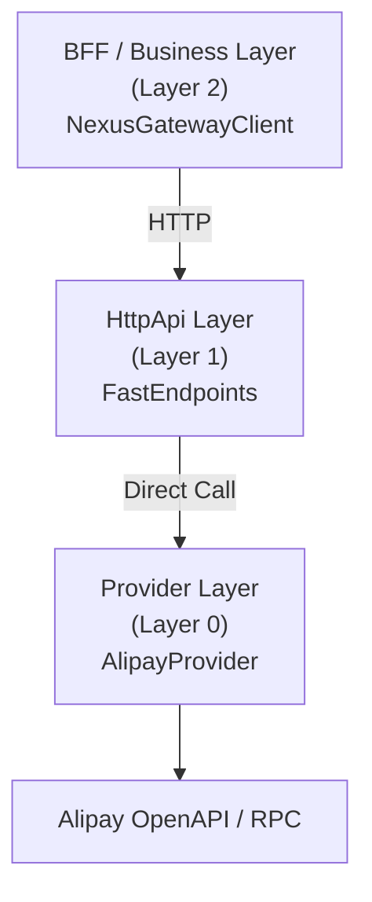
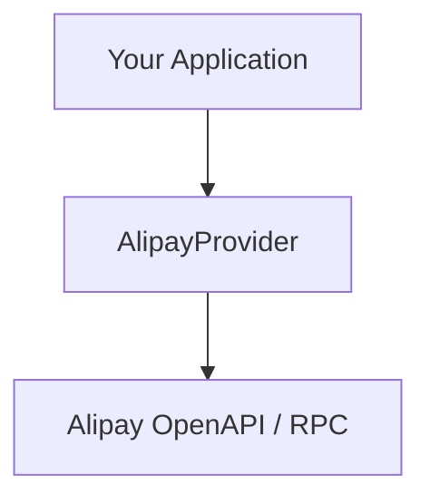

# NexusContract (Elite Edition)

> **English (Current)** | **[中文文档 (Chinese)](./README.zh-CN.md)**

**Kernelized Contract Integration (KCI) Framework**
A high-performance, deterministic, metadata-driven integration framework for payment and third-party systems, built on **.NET Standard 2.0 + .NET 10**.

> **“Explicit boundaries over implicit magic.”**
> This is not a slogan — it is the constitutional principle of NexusContract.

All designs in this framework revolve around:

* **Determinism**
* **Observability**
* **Architectural Constraints**
* **Fail-Fast correctness**

---

## 🧭 What Problem Does NexusContract Solve?

In real-world payment and third-party integrations:

* OpenAPI, RPC, and undocumented interfaces **coexist**
* The same business intent maps to **multiple provider operations**
* A missing encrypted field name is **not a bug — it is a financial incident**
* Runtime validation is **already too late**

Most frameworks treat contracts as **DTOs or configurations**.

**NexusContract treats contracts as a constitution.**

---

## 🏛️ Core Architecture: From REPR to REPR-P

NexusContract extends the **REPR (Request–Endpoint–Response)** pattern from
[FastEndpoints](https://fast-endpoints.com/) by introducing **Proxying**, forming the **REPR-P** model.

### REPR-P Explained

* **R — Request**
  Strongly-typed business intent
  (`IApiRequest<TResponse>`)

* **E — Endpoint**
  **Zero-business-code proxy**
  Responsible only for protocol adaptation

* **R — Response**
  Strongly-typed business result

* **P — Proxy**
  `NexusGateway`
  The orchestration core that executes the pipeline and routes calls to Providers

> Business logic never leaks into transport layers.
> Transport concerns never pollute contracts.

---

## 🧭 Contract Is Constitutional, Not Configurable

In NexusContract, a contract is **not**:

* a DTO
* a runtime configuration
* a flexible mapping definition

It is a **constitutional artifact**.

### What This Means

* ❌ No silent fallback
* ❌ No runtime guessing
* ❌ No environment-specific overrides
* ✅ Either fully compliant — or the service **refuses to start**

### Why So Strict?

Because in payment systems:

* Encrypted fields **must** have explicit names
* Protocol projections **must** be deterministic
* Violations must be detected **before traffic exists**

> **All constitutional violations are detected at startup, in one panoramic scan.**

---

## 🚀 Core Features

### 🔒 Constitutional Startup Health Check

* One-time panoramic scan of all contracts
* Enforces architectural rules (nesting depth, encryption rules, naming)
* Fails fast **before** the service starts accepting traffic

### 🧠 Metadata-Driven, Runtime-Frozen

* All metadata is scanned and frozen at startup
* Zero reflection at runtime
* Near-zero allocation execution path

### 🔄 Four-Phase Execution Pipeline

All requests follow the same deterministic flow:

```
Validate → Project → Execute → Hydrate
```

No shortcuts. No hidden branches.

### 🧾 Structured Diagnostics (NXC Codes)

Every violation has a unique diagnostic code:

* Static (startup)
* Outbound (provider call)
* Inbound (response hydration)

Designed for **rapid localization**, not vague logs.

---

## 🏁 Quick Start: Startup Health Check

Example from `Demo.Alipay.HttpApi`:

```csharp
// 1. Scan all ApiOperation contracts
var types = AppDomain.CurrentDomain.GetAssemblies()
    .SelectMany(a => a.GetTypes())
    .Where(t => t.IsClass && !t.IsAbstract &&
                t.GetCustomAttribute<ApiOperationAttribute>() != null)
    .ToArray();

// 2. Preload & validate (panoramic scan)
var report = NexusContractMetadataRegistry.Instance
    .Preload(types, warmup: true);

// 3. Print diagnostic report
report.PrintToConsole(includeDetails: true);

// 4. Abort startup on constitutional violation
if (report.HasCriticalErrors)
{
    Environment.Exit(1);
}
```

### Sample Output

```
╔══════════════════════════════════════════════════════════════════╗
║           NexusContract Diagnostic Report                       ║
║                    Startup Health Check                          ║
╠══════════════════════════════════════════════════════════════════╣
║ Status: ✅ HEALTHY                                               ║
║ Contracts Scanned: 6                                            ║
║ Total Issues: 0                                                  ║
║ Critical Errors: 0                                               ║
║ Warnings: 0                                                      ║
╚══════════════════════════════════════════════════════════════════╝
```

> Unlike traditional frameworks, **all violations are reported in one run**.

---

## 🎯 OperationId: Intent, Not Endpoint

`OperationId` represents **business intent**, not a physical route.

```csharp
[ApiOperation("alipay.trade.query", HttpVerb.POST)]
public sealed class TradeQueryRequest
    : IApiRequest<TradeQueryResponse> { }
```

###  Contract Routing Model

A single NexusContract defines one business operation and is consumed consistently
across all layers of the system.

Example mapping:

- **BFF**
  - Exposes: `/api/alipay/v3/trade/query`

- **HttpApi**
  - Proxies: `/api/alipay/v3/trade/query`

- **Provider**
  - Calls:
    - OpenAPI: `/v3/alipay/trade/query`
    - RPC: `alipay.trade.query`

---

## 🏗️ Three-Layer Architecture



### Direct Integration (No HttpApi)



---

## ⚙️ Role of FastEndpoints

FastEndpoints is **not the core** of NexusContract.

It is a **preferred HttpApi host implementation**.

### Why FastEndpoints?

* Explicit endpoint model
* No controller magic
* High performance
* Strong alignment with REPR

### Important

> **NexusContract does not conceptually depend on FastEndpoints.**

Only the HttpApi layer does.

You may replace it with:

* ASP.NET Minimal APIs
* MVC
* gRPC gateways
* Custom protocol servers

---

## AI Compatibility (By Design)

NexusContract is not an AI-first framework.

However, its **explicit contracts**, **frozen metadata**, and **deterministic execution model**
make it naturally compatible with:

- LLM-based code generation
- Tool calling and agent orchestration
- Static analysis and contract introspection

This is a *by-product* of strict architectural constraints,
not an AI-driven design goal.

---


## 📦 NuGet Packages

| Package | Version | Framework | Description |
|---------|---------|-----------|-------------|
| [NexusContract.Abstractions](https://www.nuget.org/packages/NexusContract.Abstractions) |  | netstandard2.0 | Core abstraction layer (zero dependencies) |
| [NexusContract.Core](https://www.nuget.org/packages/NexusContract.Core) |  | .NET 10 | Gateway engine and four-phase pipeline |
| [NexusContract.Client](https://www.nuget.org/packages/NexusContract.Client) |  | .NET 10 | Client SDK for BFF/business layer (HTTP communication) |
| [NexusContract.Providers.Alipay](https://www.nuget.org/packages/NexusContract.Providers.Alipay) |  | .NET 10 | Alipay provider (OpenAPI v3) |

---

## 📖 Usage Examples

### Layer 1 — HttpApi

```csharp
public sealed class TradeQueryEndpoint(AlipayProvider provider)
    : AlipayEndpointBase<TradeQueryRequest>(provider) { }
```

### Layer 2 — BFF / Business

```csharp
var client = new NexusGatewayClient(
    httpClient,
    new SnakeCaseNamingPolicy());

var response = await client.SendAsync(
    new TradeQueryRequest { TradeNo = "202501..." });
```

### Layer 0 — Direct Provider

```csharp
var provider = new AlipayProvider(appId, privateKey, publicKey);

var response = await provider.ExecuteAsync(
    new TradeQueryRequest { TradeNo = "202501..." });
```

---

## 🎯 Performance Characteristics

* Zero reflection at runtime
* Frozen metadata dictionaries
* Precompiled IL accessors

Typical full pipeline cost: **~120 ns**

---

## 📚 Documentation

* `CONSTITUTION.md` — Architectural rules & violation codes
* `IMPLEMENTATION.md` — Internal mechanics
* `CLIENT_SDK_GUIDE.md` — Client usage
* `PACKAGES.md` — Package overview

---

## 🧠 Final Summary

> **NexusContract is a constitutional execution kernel that treats every integration as law, not convention.**


## 📄 License

[MIT License](LICENSE)
