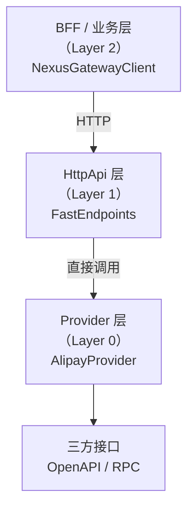
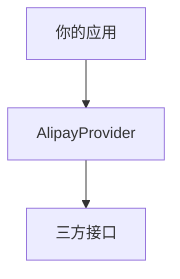

# NexusContract（精英版）

> **中文文档（当前）** | **[English](./README.md)**

**Kernelized Contract Integration（KCI）框架**
一个为 **支付系统与复杂三方集成** 而生的、高性能、强约束、元数据驱动的契约内核框架。
基于 **.NET Standard 2.0 + .NET 10** 构建。

> **“显式边界，胜过隐式魔法。”**
> 这不是口号，而是 NexusContract 的最高宪法。

---

## 🧭 NexusContract 解决什么问题？

在真实世界的支付与三方集成中，你一定遇到过这些情况：

* 同一个业务语义，对应 **多个三方接口**
* OpenAPI、RPC、HTTP、私有协议 **同时存在**
* 有的接口有官网文档，有的只能**拉群口口相传**
* 老系统里：

  * 字符串拼接
  * DTO / Dictionary 混用
  * JSON 动态字段
  * 新人随意改字段名
* **运行时才发现字段没传 / 传错 / 加密字段名不一致**

这些问题的共同本质只有一个：

> **“契约不可信。”**

而 NexusContract 的目标只有一句话：

> **把“不可信”变成“启动即失败”。**

---

## 🏛️ 核心理念：契约不是 DTO，而是宪法

在 NexusContract 中：

* ❌ 契约不是“随便定义的模型”
* ❌ 契约不是“运行时容错的配置”
* ❌ 契约不是“AI 可以自由发挥的草稿”

### 契约是【宪法级】的存在

* 一旦定义
* 必须 **明确**
* 必须 **完整**
* 必须 **可验证**
* 必须 **Fail-Fast**

> **任何违反宪法的行为，都会在应用启动阶段被整体扫描并拒绝启动。**

---

## 🏗️ 核心架构：从 REPR 到 REPR-P

NexusContract 基于
[FastEndpoints](https://fast-endpoints.com/) 提出的 **REPR（Request–Endpoint–Response）** 模式，
引入 **Proxy（代理）** 概念，形成 **REPR-P** 架构。

### 什么是 REPR-P？

* **R — Request（请求）**
  强类型的业务契约
  `IApiRequest<TResponse>`

* **E — Endpoint（端点）**
  **零业务逻辑的代理端点**
  只负责协议适配，不写业务

* **R — Response（响应）**
  强类型业务结果

* **P — Proxy（代理内核）**
  `NexusGateway`
  统一执行校验、投影、调用、回填

> Endpoint 不理解业务
> Provider 不理解 HTTP
> Contract 只描述“我是谁”，不描述“我怎么实现”

---

## 🔒 宪法级启动扫描（Startup Health Check）

### 你不能再相信这些东西

* “跑起来没问题”
* “线上先观察”
* “文档应该是对的”
* “这个字段一般不会变”

### NexusContract 的做法

> **在启动阶段，一次性、全量、全景扫描所有契约。**

包括但不限于：

* ApiOperation 是否唯一、合法
* OperationId 是否冲突
* 加密字段是否显式指定名称
* 字段嵌套深度是否超限
* 投影是否可确定
* 命名策略是否存在歧义

**任何一条违反 → 启动失败**

---

## 🚀 核心能力一览

### ✅ 元数据驱动，运行期冻结

* 启动时扫描
* 构建 Frozen Metadata
* 运行期 **零反射**
* 零猜测、零回退

### ✅ 四阶段确定性执行管线

所有请求统一走：

```
Validate → Project → Execute → Hydrate
```

不允许绕过，不允许“特殊处理”。

### ✅ Fail-Fast 字段约束（以加密字段为例）

```csharp
// ❌ 错误：加密字段未显式指定名称
[ApiField(IsEncrypted = true)]
public string CardNo { get; set; }

// ✅ 正确
[ApiField("card_no", IsEncrypted = true)]
public string CardNo { get; set; }
```

> 这是宪法规则，不是编码建议。
> 违反即 NXC106，启动失败。

### ✅ 结构化诊断码（NXC-xxx）

* 启动期
* 出站
* 入站

全部统一为 **机器可识别 + 人类可定位** 的诊断码体系。

---

## 🧠 OperationId：业务意图，而非路由

```csharp
[ApiOperation("alipay.trade.query", HttpVerb.POST)]
public sealed class TradeQueryRequest
    : IApiRequest<TradeQueryResponse> { }
```

### Contract 路由与调用模型

一个 NexusContract 只描述一个业务操作。

该业务操作在不同层中，可以采用不同的路由或协议形式，
但其业务语义始终保持一致。

示例：支付宝交易查询

* BFF：`/api/alipay/v3/trade/query`
* HttpApi：`/api/alipay/v3/trade/query`
* 三方：

  * OpenAPI：`/v3/alipay/trade/query`
  * RPC：`alipay.trade.query`

> Contract 只定义“做什么”，路由、协议与调用方式由所在层负责解析。

---

## 🏗️ 三层架构设计



### 直接集成模式（跳过 HttpApi）



---

## 🧭 架构选型建议

| 场景           | 推荐方案             |
| ------------ | ---------------- |
| 微服务 / 统一支付网关 | HttpApi + Client |
| 单体应用         | Provider 直连      |
| 多租户 SaaS     | HttpApi + Client |
| 老系统替换        | 契约优先，Provider 重写 |

---

## ⚙️ FastEndpoints 在这里的定位

> **FastEndpoints 不是核心依赖，而是推荐的 HttpApi 宿主。**

选择它的原因：

* 明确的 Endpoint 模型
* 无 Controller 魔法
* 高性能
* 与 REPR 天然契合

> NexusContract 的核心 **不依赖 FastEndpoints**
> 你可以替换为任意协议宿主。

---

## 📦 NuGet 包说明

| Package | Version | Framework | Description |
|---------|---------|-----------|-------------|
| [NexusContract.Abstractions](https://www.nuget.org/packages/NexusContract.Abstractions) |  | netstandard2.0 | Core abstraction layer (zero dependencies) |
| [NexusContract.Core](https://www.nuget.org/packages/NexusContract.Core) |  | .NET 10 | Gateway engine and four-phase pipeline |
| [NexusContract.Client](https://www.nuget.org/packages/NexusContract.Client) |  | .NET 10 | Client SDK for BFF/business layer (HTTP communication) |
| [NexusContract.Providers.Alipay](https://www.nuget.org/packages/NexusContract.Providers.Alipay) |  | .NET 10 | Alipay provider (OpenAPI v3) |

---

## 📖 使用示例

### HttpApi 层

```csharp
public sealed class TradeQueryEndpoint(AlipayProvider provider)
    : AlipayEndpointBase<TradeQueryRequest>(provider) { }
```

### BFF / 业务层

```csharp
var client = new NexusGatewayClient(
    httpClient,
    new SnakeCaseNamingPolicy());

var response = await client.SendAsync(
    new TradeQueryRequest { TradeNo = "202501..." });
```

### Provider 直连

```csharp
var provider = new AlipayProvider(appId, privateKey, publicKey);

var response = await provider.ExecuteAsync(
    new TradeQueryRequest { TradeNo = "202501..." });
```

---

## 🎯 性能特性

* 启动期扫描
* 运行期零反射
* FrozenDictionary
* 预编译 IL Getter / Setter

**完整调用链约 ~120ns**

---

## 📚 进一步阅读

* `CONSTITUTION.md` —— 架构宪法与规则编号
* `IMPLEMENTATION.md` —— 内部实现细节
* `CLIENT_SDK_GUIDE.md` —— 客户端使用说明

---


## 🧠 一句话总结

> **NexusContract 是一个把三方集成当成“法律系统”来执行的内核，而不是 SDK。**


---

**维护者：** [pubsoft](pubsoft@gmail.com)

**项目地址：** [https://github.com/NexusContract/PubSoft.NexusContract](https://github.com/NexusContract/PubSoft.NexusContract)

**NuGet：** [https://www.nuget.org/profiles/pubsoft](https://www.nuget.org/profiles/pubsoft)

---

## 📄 License

MIT License