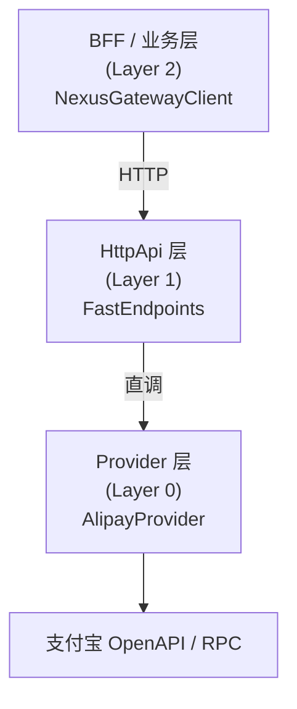
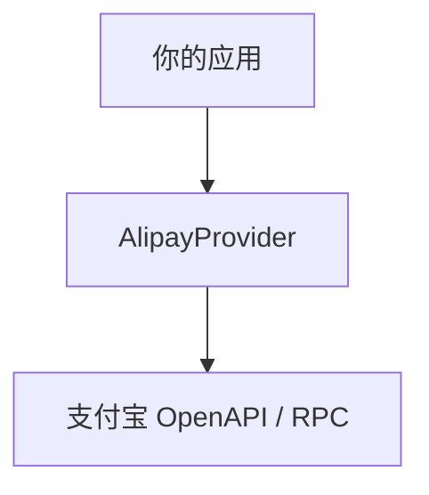

# NexusContract（精英版）

> **[English](./README.md)** | **中文文档（当前）**

**Kernelized Contract Integration（KCI）框架**  
一个以「启动期校验」为核心的 **契约执行内核**，  
用于支付与第三方系统集成，基于 **.NET Standard 2.0 + .NET 10**。

> **“显式边界，优于隐式魔法。”**  
> 这不是口号，而是 NexusContract 的宪法级设计原则。

> ## 📐 架构蓝图 (v1.1 — Provider 物理扩展与跨云支持)
> 完整蓝图请参阅：`docs/ARCHITECTURE_BLUEPRINT.zh-CN.md`（v1.1，2026‑01‑10）。  
> **当前代码库：** `v1.0.0‑preview.10` — 已实现蓝图的核心宪法约束（启动期校验、零反射、确定性执行），ISV 扩展（JIT Resolver、Realm/Profile、YarpTransport）正在受控环境中逐步落地。替换验证完成后将更新文档以反映最终覆盖情况。

本框架所有设计均围绕以下目标展开：

- **确定性（Determinism）**
- **可观测性（Observability）**
- **架构约束（Architectural Constraints）**
- **Fail-Fast 正确性（启动即失败，而非运行期补救）**

---

## 🧭 NexusContract 解决的是什么问题？

在真实的支付 / 三方集成场景中，普遍存在以下问题：

- OpenAPI、RPC、私有接口 **长期并存**
- 同一个业务语义，在不同协议中有 **不同表达**
- 一个加密字段漏写名称，**不是 Bug，而是事故**
- 等到运行期才发现问题，**已经太晚**

传统框架通常将 Contract 视为：

- DTO
- 运行期配置
- 灵活映射规则

**NexusContract 的核心立场是：**

> Contract 不是配置，而是「系统必须遵守的约束」。  
> 如果约束不成立，系统不应启动。

---

## 🏛️ 核心架构：从 REPR 到 REPR-P

NexusContract 基于  
[FastEndpoints](https://fast-endpoints.com/) 的 **REPR（Request–Endpoint–Response）** 模型，
引入 **Proxy（代理）** 概念，形成 **REPR-P 架构模型**。

### REPR-P 拆解说明

- **R — Request（请求）**  
  强类型的业务意图  
  `IApiRequest<TResponse>`

- **E — Endpoint（端点）**  
  **零业务代码**  
  仅负责协议承载与转发

- **R — Response（响应）**  
  强类型的业务结果

- **P — Proxy（代理 / 内核）**  
  `NexusGateway`  
  执行统一管道，并将请求路由至具体 Provider

> 业务逻辑不下沉到传输层  
> 传输细节不上浮到契约层

---

## 🧭 契约是“宪法”，不是“配置”

在 NexusContract 中，一个 Contract **不是**：

- DTO
- 可选配置
- 环境相关映射

而是一个 **宪法级构件**。

### 这意味着什么？

- ❌ 不允许静默降级
- ❌ 不允许运行期猜测
- ❌ 不允许环境差异绕过
- ✅ 要么完全合规，要么 **拒绝启动**

### 为什么必须这么严格？

因为在支付系统中：

- 加密字段 **必须显式声明名称**
- 协议投影 **必须确定**
- 错误必须在 **流量进入前** 暴露

NexusContract 的基本原则是：

> **所有违反契约的行为，都必须在启动期一次性暴露出来。**

---

## 🚀 核心能力概览

### 🔒 启动期宪法体检（Startup Health Check）

- 启动时一次性扫描所有契约
- 校验加密规则、命名规则、嵌套深度等
- 若存在阻断级错误，**服务不允许启动**

### 🧠 元数据驱动，运行期冻结

- 启动期完成所有扫描与编译
- 运行期 **零反射**
- 执行路径几乎零额外分配

### 🔄 四阶段确定性执行管道

所有请求都必须经过以下阶段：

```

Validate → Project → Execute → Hydrate

````

没有捷径，也没有隐藏分支。

### 🧾 结构化诊断（NXC 错误码）

所有错误均具备稳定的诊断码：

- 启动期（静态）
- 出站（请求投影）
- 入站（响应反序列化）

用于 **定位问题，而非“看日志猜原因”**。

---

## 🏁 快速开始：启动期体检

示例来自 `Demo.Alipay.HttpApi`：

```csharp
// 1. 扫描所有 ApiOperation 契约
var types = AppDomain.CurrentDomain.GetAssemblies()
    .SelectMany(a => a.GetTypes())
    .Where(t => t.IsClass && !t.IsAbstract &&
                t.GetCustomAttribute<ApiOperationAttribute>() != null)
    .ToArray();

// 2. 预加载并执行全量校验
var report = NexusContractMetadataRegistry.Instance
    .Preload(types, warmup: true);

// 3. 输出体检报告
report.PrintToConsole(includeDetails: true);

// 4. 存在宪法级错误则阻断启动
if (report.HasCriticalErrors)
{
    Environment.Exit(1);
}
````

### 示例输出

```
╔══════════════════════════════════════════════════════════════════╗
║           NexusContract 契约体检报告                             ║
║                    启动期健康检查                               ║
╠══════════════════════════════════════════════════════════════════╣
║ 状态: ✅ 健康                                                   ║
║ 扫描契约数: 6                                                   ║
║ 问题总数: 0                                                     ║
║ 阻断级错误: 0                                                   ║
║ 警告: 0                                                         ║
╚══════════════════════════════════════════════════════════════════╝
```

> 所有问题 **一次启动全部暴露**，而不是“修一个跑一次”。

---

## 🎯 OperationId：业务意图标识，而非路由

`OperationId` 表示 **一个业务意图**，
而不是 HTTP 路径或方法。

```csharp
[ApiOperation("alipay.trade.query", HttpVerb.POST)]
public sealed class TradeQueryRequest
    : IApiRequest<TradeQueryResponse> { }
```

### 契约在多层架构中的一致映射

一个 NexusContract 在系统中保持语义一致：

* **BFF**

  * 对外暴露：`/api/alipay/v3/trade/query`

* **HttpApi**

  * 原样代理：`/api/alipay/v3/trade/query`

* **Provider**

  * 实际调用：

    * OpenAPI：`/v3/alipay/trade/query`
    * RPC：`alipay.trade.query`

---

## 🏗️ 三层架构模型



### 直接集成（跳过 HttpApi）



---

## ⚙️ FastEndpoints 的角色定位

FastEndpoints **不是 NexusContract 的核心**。

它只是：

> 一个非常契合 HttpApi 层职责的实现选择。

### 为什么选 FastEndpoints？

* Endpoint 模型显式
* 无 Controller 魔法
* 性能稳定
* 与 REPR 模式天然契合

> NexusContract 在概念上 **不依赖 FastEndpoints**。

你可以替换为：

* ASP.NET Minimal API
* MVC
* gRPC Gateway
* 自定义协议服务

---

## 🤖 关于 AI 友好性

NexusContract 并非 AI 优先框架。

但由于其：

* 契约显式
* 元数据冻结
* 执行路径确定

它天然适合：

* LLM 生成代码
* Tool / Agent 调用
* 静态分析与契约自省

这是 **严谨架构约束的自然结果**，而非设计目标。

---

## 📦 NuGet 包结构

| 包名                             | 目标框架           | 说明                         |
| ------------------------------ | -------------- | -------------------------- |
| NexusContract.Abstractions     | netstandard2.0 | 核心抽象，无外部依赖                 |
| NexusContract.Core             | .NET 10        | 契约执行内核                     |
| NexusContract.Client           | .NET 10        | BFF / 业务层客户端               |
| NexusContract.Providers.Alipay | .NET 10        | 支付宝 OpenAPI / RPC Provider |

---

## 📖 使用示例

### HttpApi 层

```csharp
public sealed class TradeQueryEndpoint(AlipayProvider provider)
    : AlipayEndpointBase<TradeQueryRequest>(provider) { }
```

### BFF / 业务层

```csharp
var client = new NexusGatewayClient(
    httpClient,
    new SnakeCaseNamingPolicy());

var response = await client.SendAsync(
    new TradeQueryRequest { TradeNo = "202501..." });
```

### Provider 直调

```csharp
var provider = new AlipayProvider(appId, privateKey, publicKey);

var response = await provider.ExecuteAsync(
    new TradeQueryRequest { TradeNo = "202501..." });
```

---

## 🎯 性能特征

* 运行期零反射
* 冻结元数据字典
* 预编译 IL 访问器

完整执行链路约 **~120ns**

---

## 🚫 非目标说明

NexusContract 不尝试：

* 推断缺失字段
* 提供运行期自动修复
* 作为通用流程引擎

---

## 🧠 总结

> **NexusContract 是一个将集成视为“宪法执行”的运行时内核，
> 用于那些不能靠“约定”和“经验”兜底的系统。**

---

## 📄 License

MIT License

```