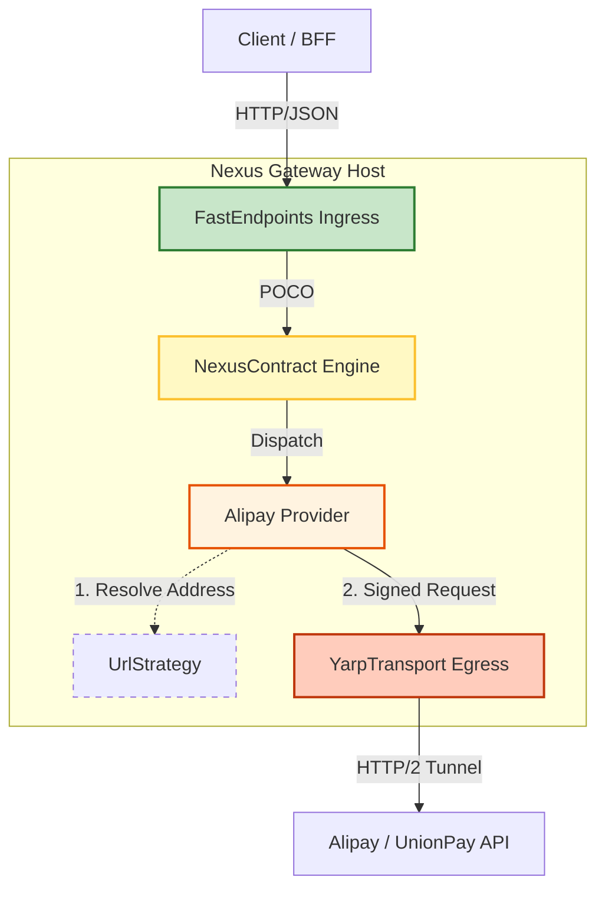

# 🏛️ NexusContract Architecture Blueprint v1.0

> **Version:** 0.1 (Final Revision)
> **Status:** ✅ Approved
> **Date:** January 10, 2026
> **Scope:** End-to-End High-Performance Gateway Architecture

## 1. Architectural Overview

The architecture follows a strict **"Receiver-Dispatcher-Transporter"** flow, integrating **FastEndpoints** (Ingress) with **NexusContract** (Logic) and **YARP** (Egress).

### Component Roles & Responsibilities

| Component | Layer | Metaphor | Responsibility | Dependency Scope |
| --- | --- | --- | --- | --- |
| **FastEndpoints** | **Ingress** | **Reception Desk** | **Entry Point.** Validates incoming HTTP requests, handles Auth, and invokes the Nexus Engine. | 🟢 **Presentation** |
| **NexusContract.Core** | **Engine** | **Dispatcher** | **Processing Center.** Validates contracts, executes pipelines, and orchestrates Providers. | 🟡 **Core Logic** |
| **NexusContract.Providers** | **Adapter** | **Packer** | **Business Logic.** Encapsulates vendor-specific logic (Signing, Encryption) and maps protocols. | 🟡 **Business Logic** |
| **NexusContract.Hosting.Yarp** | **Egress** | **Truck Fleet** | **Outbound Transport.** Sends requests to upstream APIs using high-performance HTTP/2 tunnels. | 🔴 **Infrastructure** |

---

## 2. Physical Architecture & Data Flow

**Layout Note:** The flow proceeds from Top to Bottom to prevent horizontal scrolling.



---

## 3. Core Abstractions (`NexusContract.Abstractions`)

These interfaces decouple the **Business Intent** from the **Physical Execution**.

### A. Transport Abstraction (`INexusTransport`)

Decouples Providers from the underlying HTTP client implementation.

```csharp
namespace NexusContract.Transports;

public interface INexusTransport
{
    /// <summary>
    /// Asynchronously sends an HTTP request.
    /// </summary>
    /// <param name="request">The signed HttpRequestMessage.</param>
    /// <param name="context">Context containing metadata (Retry Policy, Timeout, Tracing ID).</param>
    Task<HttpResponseMessage> SendAsync(
        HttpRequestMessage request, 
        NexusContext context, 
        CancellationToken ct = default);
}

```

### B. Routing Strategy (`IUpstreamUrlBuilder`)

Decouples "Logical Operation IDs" from "Physical URLs", ensuring deterministic signing.

```csharp
namespace NexusContract.Routing;

public interface IUpstreamUrlBuilder
{
    /// <summary>
    /// Resolves the physical upstream URI based on the Operation ID.
    /// Example: "alipay.trade.pay" -> "https://openapi.alipay.com/v3/pay"
    /// </summary>
    Uri Build(string operationId, ProviderSettings settings);
}

```

---

## 4. Implementation Strategy

### A. Ingress Layer (FastEndpoints)

Acts as the host for NexusContract, handling the initial request reception.

```csharp
public class CreateTradeEndpoint : Endpoint<CreateTradeRequest, TradeResponse>
{
    public INexusEngine _engine { get; set; } // Inject the Core Engine

    public override void Configure()
    {
        Post("/api/trade/create");
        AllowAnonymous();
    }

    public override async Task HandleAsync(CreateTradeRequest req, CancellationToken ct)
    {
        // 1. Ingress: FastEndpoints binds JSON to POCO
        
        // 2. Dispatch: Nexus Engine finds the provider, signs, and sends
        var result = await _engine.ExecuteAsync(req, ct);

        // 3. Response: Return standardized result
        await SendAsync(result);
    }
}

```

### B. Business Layer (Provider)

Providers focus on protocol projection and security.

```csharp
public class AlipayProvider(
    INexusTransport _transport,     // Injected: YarpTransport or HttpClientTransport
    IUpstreamUrlBuilder _urlBuilder // Injected: RPC or REST V3 Strategy
) : IProvider
{
    public async Task<TResponse> ExecuteAsync<TResponse>(IApiRequest<TResponse> request, NexusContext ctx)
    {
        // 1. Addressing: Resolve physical URL BEFORE signing
        var targetUri = _urlBuilder.Build(request.GetOperationId(), _settings);

        // 2. Signing: Sign the DETERMINISTIC URL and Body
        var httpRequest = _signer.SignRequest(request, targetUri);

        // 3. Transport: Delegate to infrastructure
        var response = await _transport.SendAsync(httpRequest, ctx);

        return await _hydrator.HydrateAsync<TResponse>(response);
    }
}

```

### C. Infrastructure Layer (Transport Comparison)

| Feature | Default Transport (`NexusContract.Core`) | High-Performance Transport (`NexusContract.Hosting.Yarp`) |
| --- | --- | --- |
| **Base Tech** | `System.Net.Http.HttpClient` | `Yarp.ReverseProxy.Forwarder` |
| **Use Case** | Development, Functional Testing | Production, High Concurrency |
| **Connection Pooling** | Standard `SocketsHttpHandler` | Aggressive Reuse, Active Health Checks |
| **Multiplexing** | Standard | **HTTP/2 & HTTP/3 Multiplexing** |
| **Setup** | Built-in (Zero Config) | Opt-in via `.UseYarpTransport()` |

---

## 5. Composition Root (Program.cs)

Wiring everything together using .NET Dependency Injection.

```csharp
var builder = WebApplication.CreateBuilder(args);

// 1. Ingress: Add FastEndpoints
builder.Services.AddFastEndpoints();

// 2. Logic: Add NexusContract & Providers
builder.Services.AddNexusContract(options =>
{
    options.AddAlipay(alipay => 
    {
        // Strategy: Use REST V3 endpoints
        alipay.UseUrlStrategy<RestV3UrlBuilder>();
        alipay.AppId = builder.Configuration["Alipay:AppId"];
    });
});

// 3. Egress: Add YARP (Production Only)
if (builder.Environment.IsProduction())
{
    // Replaces default transport with YARP implementation
    builder.Services.AddNexusYarpHosting(config => 
    {
        config.MaxConnectionsPerServer = 1000;
        config.EnableHttp2 = true;
    });
}

var app = builder.Build();

// 4. Start Pipeline
app.UseFastEndpoints();
app.Run();

```

---

## 6. Key Architecture Decisions (ADR Summary)

* **ADR-001: Ingress/Egress Separation**
* **FastEndpoints** handles Ingress (Client -> Gateway).
* **YARP** handles Egress (Gateway -> Upstream).


* **ADR-002: Client Purity**
* `NexusContract.Client` SDK has zero dependencies on YARP or Core logic.


* **ADR-003: Deterministic Signing**
* URL resolution (`IUpstreamUrlBuilder`) must occur inside the Provider logic *before* signing to prevent signature mismatches.