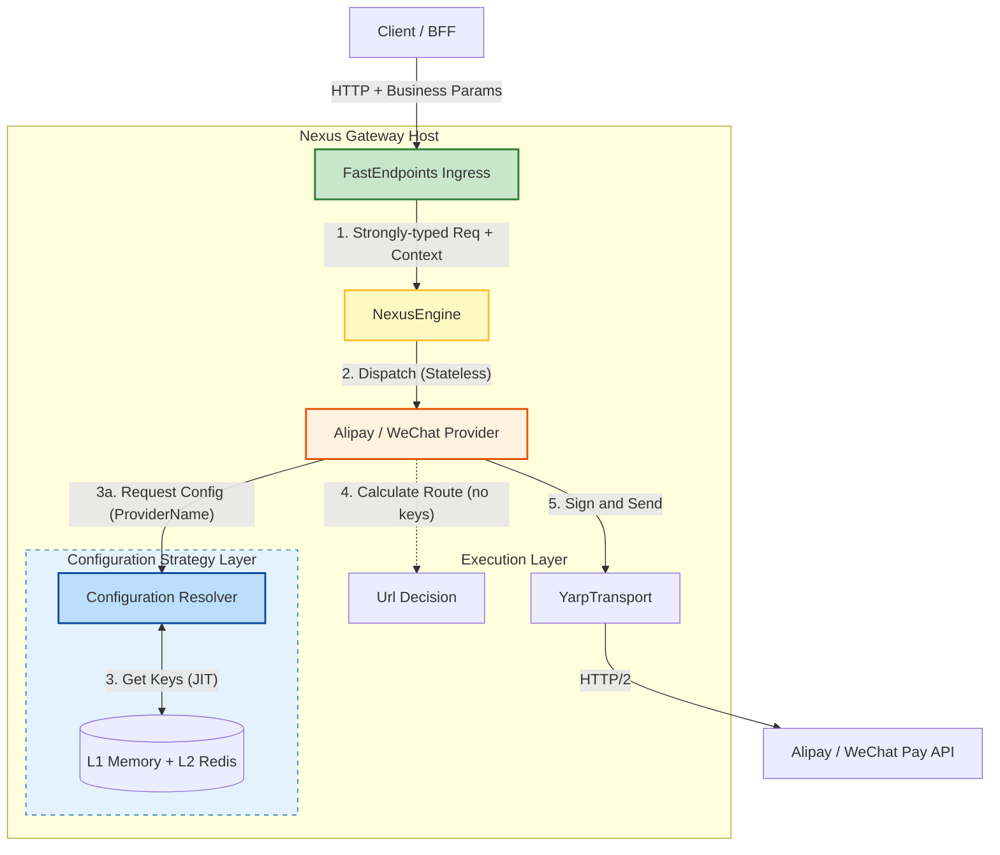
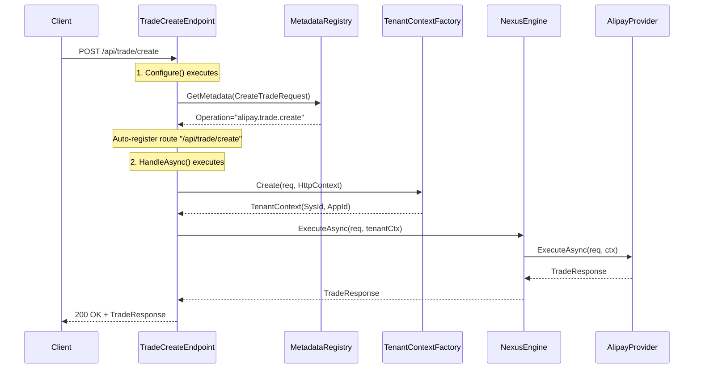

# 🏛️ NexusContract Architecture Blueprint v1.2 (Final Execution Release)

> **Version:** 1.2 (ISV Multi-Tenant Execution Release)
> **Status:** ✅ Approved
> **Date:** January 10, 2026
> **Scenario:** High-concurrency ISV gateway for Alipay/WeChat Pay (hundreds of merchants dynamic access)
> **Technical Constraints:** Core contracts compatible with .NET Standard 2.0 (WinForm/Legacy support)

## 1. Architectural Overview

This architecture follows the **"Ingress -> Dispatcher -> JIT Resolver -> Executor"** pipeline model.

### Core Component Responsibilities

| Component | Layer | Metaphor Role | Responsibility | Key Features |
|-----------|-------|---------------|----------------|--------------|
| **FastEndpoints** | **Ingress** | **Receiver** | Dumb terminal. Handles metadata routing, exception normalization, tenant context extraction. | 🟢 **Metadata Zero-Code** |
| **NexusEngine** | **Core** | **Dispatcher** | Brain. Routes to corresponding Provider based on Request type. | 🟡 **Stateless Dispatch** |
| **ConfigResolver** | **Strategy** | **Butler** | **New Introduction**. Maps business identity (Realm/Profile) to physical configuration. | 🔵 **JIT Dynamic Loading** |
| **Provider** | **Business** | **Expert** | Stateless singleton. Handles signing and protocol conversion only, no static configuration. | 🟡 **Environment Isolation** |
| **YarpTransport** | **Egress** | **Fleet** | High-performance HTTP/2 connection pool tunnel. | 🔴 **Multiplexing** |

---

## 2. Physical Architecture and Data Flow



---

## 3. Core Contracts (`NexusContract.Abstractions`)

**Technical Constraints:** Target framework **.NET Standard 2.0**. Strictly prohibit `record`, `required`, `init`.

### A. Configuration Context

```csharp
namespace NexusContract.Abstractions;

public class ConfigurationContext
{
    // Mandatory constructor validation
    public ConfigurationContext(string providerName, string realmId)
    {
        if (string.IsNullOrEmpty(providerName)) throw new ArgumentNullException(nameof(providerName));
        if (string.IsNullOrEmpty(realmId)) throw new ArgumentNullException(nameof(realmId));

        ProviderName = providerName;
        RealmId = realmId;
    }

    /// <summary>Channel identifier (e.g. "Alipay")</summary>
    public string ProviderName { get; private set; }

    /// <summary>Domain/Ownership (corresponds to SysId / SpMchId)</summary>
    public string RealmId { get; private set; }

    /// <summary>Profile/Execution Unit (corresponds to AppId / SubMchId)</summary>
    public string ProfileId { get; set; }

    public Dictionary<string, object> Metadata { get; set; }
}

```

### B. Routing Context - **Security Isolation**

```csharp
public class RoutingContext
{
    public RoutingContext(Uri baseUrl)
    {
        if (baseUrl == null) throw new ArgumentNullException(nameof(baseUrl));
        BaseUrl = baseUrl;
    }

    public Uri BaseUrl { get; private set; }
    public string Version { get; set; }
}

public interface IUpstreamUrlBuilder
{
    // ✅ Fixed: Only receives pure Context, not Settings containing private keys
    Uri Build(string operationId, RoutingContext context);
}

```

---

## 4. Key Implementation Strategies

### A. Ingress Layer: Zero-Code and Metadata-Driven

Using **Template Method Pattern**. Base class handles routing, tenant extraction, engine dispatch, and **NxcErrorEnvelope** encapsulation.

```csharp
// Core Base Class: NexusEndpointBase
// 🔥 Key Design: Only TReq is required, response type automatically inferred from IApiRequest<TResp>
public abstract class NexusEndpointBase<TReq> : Endpoint<TReq, TReq.TResponse>
    where TReq : class, IApiRequest<TReq.TResponse>, new()
{
    private readonly INexusEngine _engine; // Replace specific Provider with universal dispatch
    private readonly ILogger _logger;

    protected NexusEndpointBase(INexusEngine engine, ILogger logger)
    {
        _engine = engine;
        _logger = logger;
    }

    public override void Configure()
    {
        // 1. [Zero-Code] Auto-generate routes based on [ApiOperation] metadata
        var metadata = NexusContractMetadataRegistry.Instance.GetMetadata(typeof(TReq));

        if (metadata?.Operation == null)
            throw new InvalidOperationException($"Missing [ApiOperation] on {typeof(TReq).Name}");

        // e.g., "nexus.trade.create" -> "/api/trade/create"
        string route = RouteStrategy.Convert(metadata.Operation.OperationId);

        Post(route);
        AllowAnonymous();
    }

    public override async Task HandleAsync(TReq req, CancellationToken ct)
    {
        try
        {
            // 2. [ISV Feature] Auto-extract tenant context (SysId/AppId)
            var tenantCtx = TenantContextFactory.Create(req, HttpContext);

            // 3. [Dispatcher] Delegate to engine dispatch
            var response = await _engine.ExecuteAsync(req, tenantCtx, ct);

            await SendAsync(response);
        }
        // 4. [Error Normalization] Unified error contract (NxcErrorEnvelope)
        catch (ContractIncompleteException ex)
        {
            await SendEnvelopeAsync(400, "NXC200", ex.Message, ex.GetDiagnosticData(), ct);
        }
        catch (NexusTenantException ex) // Tenant resolution failure
        {
            await SendEnvelopeAsync(403, "TENANT_INVALID", ex.Message, null, ct);
        }
        catch (Exception ex)
        {
            _logger.LogError(ex, "Gateway Error");
            await SendEnvelopeAsync(500, "NXC999", "Internal Server Error", null, ct);
        }
    }
}

```

#### 🚀 Business Endpoint Implementation Examples (Zero-Code in Action)

**Traditional Approach vs NexusContract Comparison:**

```csharp
// ❌ Traditional Approach: Each Endpoint requires massive boilerplate (70+ lines)
// Note: Even traditional approach needs to explicitly specify TradeResponse
public class TradeCreateEndpoint_Traditional : Endpoint<CreateTradeRequest, TradeResponse>
{
    private readonly IAlipayProvider _alipayProvider;
    private readonly ILogger<TradeCreateEndpoint_Traditional> _logger;

    public TradeCreateEndpoint_Traditional(IAlipayProvider alipayProvider, ILogger<...> logger)
    {
        _alipayProvider = alipayProvider;
        _logger = logger;
    }

    public override void Configure()
    {
        Post("/api/alipay/trade/create");  // Hardcoded route
        AllowAnonymous();
    }

    public override async Task HandleAsync(CreateTradeRequest req, CancellationToken ct)
    {
        try
        {
            // Manual tenant extraction
            var sysId = HttpContext.Request.Headers["X-SysId"].ToString();
            var appId = req.AppId ?? HttpContext.Request.Headers["X-AppId"].ToString();
            
            if (string.IsNullOrEmpty(sysId) || string.IsNullOrEmpty(appId))
                throw new ArgumentException("Missing tenant identifier");

            // Manual Provider invocation
            var response = await _alipayProvider.ExecuteAsync(req, ct);
            await SendAsync(response);
        }
        // Manual exception handling
        catch (ContractIncompleteException ex)
        {
            await SendAsync(new ErrorResponse 
            { 
                Code = "NXC200", 
                Message = ex.Message 
            }, 400);
        }
        catch (Exception ex)
        {
            _logger.LogError(ex, "Alipay trade creation failed");
            await SendAsync(new ErrorResponse 
            { 
                Code = "NXC999", 
                Message = "Internal Server Error" 
            }, 500);
        }
    }
}

// ✅ NexusContract Approach: Ultimate simplicity, true zero-code (1 line!)
// 🔥 Key: No need to specify response type! Framework auto-infers from IApiRequest<TradeResponse>
// 💎 .NET 10 Feature: Primary Constructor completely eliminates constructor boilerplate
public sealed class TradeCreateEndpoint(INexusEngine engine) 
    : NexusEndpointBase<CreateTradeRequest>(engine) { }

// ✅ Same applies to all other Endpoints - response type determined by contract interface
public sealed class TradePayEndpoint(INexusEngine engine) 
    : NexusEndpointBase<TradePayRequest>(engine) { }

public sealed class TradeQueryEndpoint(INexusEngine engine) 
    : NexusEndpointBase<TradeQueryRequest>(engine) { }

public sealed class TradeRefundEndpoint(INexusEngine engine) 
    : NexusEndpointBase<TradeRefundRequest>(engine) { }

// ✅ Cross-channel consistency: WeChat Pay Endpoint has identical structure
public sealed class WeChatPayEndpoint(INexusEngine engine) 
    : NexusEndpointBase<WeChatPayRequest>(engine) { }

```

#### 🎯 Framework Advantages (Key Advantages)

| Dimension | Traditional Approach | NexusContract | Advantage |
|-----------|---------------------|---------------|-----------|
| **Code Volume** | 70+ lines per Endpoint | 1 line per Endpoint (.NET 10) | **99% code reduction** |
| **Route Configuration** | Hardcoded strings | Metadata auto-generated | Zero hardcoding, type-safe |
| **Tenant Extraction** | Manual Header/Body parsing | Auto-recognition & extraction | Framework auto-handles |
| **Exception Handling** | Repeated in each Endpoint | Base class unified handling | Global consistency |
| **Error Format** | Custom ErrorResponse | Standard NxcErrorEnvelope | Contract standardization |
| **Testability** | Need Mock HttpContext | Pure POCO unit tests | No infrastructure dependencies |
| **New API Addition** | Copy-paste 70-line template | 1 line completion | **70x development efficiency** |
| **Cross-channel Consistency** | Per-channel custom implementation | Completely unified structure | Reduced cognitive load |

#### 💡 Runtime Execution Flow

When requesting `POST /api/trade/create`, framework automatically completes:



#### 🔥 Developer Experience

```csharp
// 1️⃣ Define Contract (in NexusContract.Abstractions)
// 🔥 Core: IApiRequest<TradeResponse> already declares the response type
// 📋 Convention: Use [ApiField] for precise control over field mapping (e.g., snake_case), encryption marking, required constraints, etc.
[ApiOperation("alipay.trade.create", HttpVerb.POST)]
public class CreateTradeRequest : IApiRequest<TradeResponse>
{
    [ApiField("out_trade_no", IsRequired = true, Description = "Merchant order number")]
    public string OutTradeNo { get; set; }
    
    [ApiField("total_amount", IsRequired = true, Description = "Order total amount in yuan")]
    public decimal TotalAmount { get; set; }
    
    [ApiField("subject", IsRequired = true, Description = "Order title")]
    public string Subject { get; set; }
}

// 2️⃣ Create Endpoint (in gateway project) - Only 1 line needed!
// 🔥 Soul Design: No need to repeat TradeResponse, framework auto-infers from contract interface
// 💎 .NET 10 Feature: Primary Constructor makes code extremely concise
// ⚠️ Key: Endpoint body is completely empty, no business logic
public sealed class TradeCreateEndpoint(INexusEngine engine) 
    : NexusEndpointBase<CreateTradeRequest>(engine) { }

// Full commented version (can add XML documentation in actual development):
/// <summary>Trade creation interface - Contract: [ApiOperation("alipay.trade.create")]</summary>
public sealed class TradeCreateEndpoint(INexusEngine engine) 
    : NexusEndpointBase<CreateTradeRequest>(engine) { }

// 3️⃣ Done! No additional configuration needed
// ✅ Route auto-generated: /api/trade/create
// ✅ Tenant auto-extracted: SysId, AppId
// ✅ Engine auto-dispatched: Routes to AlipayProvider
// ✅ Response auto-returned: await SendAsync(response) handled by base class
// ✅ Exceptions auto-normalized: NxcErrorEnvelope globally unified
// ✅ Logging auto-recorded: OperationId, TenantId
```

**This is NexusContract's advancement: Combined with .NET 10 Primary Constructor feature, 99% of boilerplate code disappears, Endpoint becomes a pure type declaration (1 line), developers only focus on business contracts.**

### B. Infrastructure: ISV Hybrid Resolver

Maps "business dialect" to "framework standard".

```csharp
public class HybridConfigResolver : IConfigurationResolver
{
    private readonly ITenantRepository _repo;

    public async Task<ProviderSettings> ResolveAsync(ConfigurationContext ctx, CancellationToken ct)
    {
        // 1. Terminology mapping: RealmId -> SysId, ProfileId -> InnerAppId
        // 2. L1/L2 cache lookup
        var config = await _repo.GetAsync(ctx.ProviderName, ctx.RealmId, ctx.ProfileId);

        if (config == null) throw new NexusTenantException("Invalid merchant configuration");
        return config;
    }
}

```

### C. Business Layer: Stateless Provider

Provider hardcodes `ProviderName` and dynamically loads configuration at runtime.

```csharp
public class AlipayProvider(IConfigurationResolver _resolver, ...) : IProvider
{
    private const string NAME = "Alipay";

    public async Task<TResponse> ExecuteAsync(IApiRequest request, NexusContext ctx)
    {
        // 1. Construct context
        var configCtx = new ConfigurationContext(NAME, ctx.Metadata["SysId"])
        {
            ProfileId = ctx.Metadata["AppId"]
        };

        // 2. JIT load configuration
        var settings = await _resolver.ResolveAsync(configCtx, CancellationToken.None);

        // 3. Sign (private key used only here)
        var targetUri = _urlBuilder.Build(request.GetOperationId(), new RoutingContext(settings.GatewayUrl));
        var httpRequest = _signer.SignRequest(request, targetUri, settings);

        return await _transport.SendAsync(httpRequest, ctx);
    }
}

```

---

## 5. Composition Root (Program.cs)

```csharp
var builder = WebApplication.CreateBuilder(args);

// 1. Core and Ingress
builder.Services.AddFastEndpoints();
builder.Services.AddNexusContract();

// 2. ISV Resolver and Repository
builder.Services.AddSingleton<IConfigurationResolver, HybridConfigResolver>();
builder.Services.AddSingleton<ITenantRepository, RedisTenantRepository>();

// 3. Register Providers
builder.Services.AddSingleton<IProvider, AlipayProvider>();

// 4. Production Egress (YARP)
if (builder.Environment.IsProduction())
{
    builder.Services.AddNexusYarpHosting();
}

var app = builder.Build();
app.UseFastEndpoints();
app.Run();

```

---

## 6. Key Architectural Decision Records (ADR Summary)

### Base Architecture (Inherited from v1.0)

* **ADR-001: Ingress/Egress Separation**
* **FastEndpoints** handles ingress (API definition), **YARP** handles egress (HTTP/2 transport).

* **ADR-002: Client Purity**
* `NexusContract.Client` SDK must remain zero-dependency, no references to FastEndpoints or YARP.

* **ADR-003: Deterministic Signing**
* URL resolution must complete inside Provider, before signing.

### ISV Enhanced Architecture (v1.1 Additions)

* **ADR-004: JIT Configuration**
* **Change:** Deprecate static `IOptions` singleton injection.
* **Decision:** Adopt `IConfigurationResolver` with L1/L2 caching.
* **Reason:** Support hundreds of merchants dynamic access, configuration updates without service restart.

* **ADR-005: Realm & Profile**
* **Decision:** Framework layer abstracts to `RealmId` (domain) and `ProfileId` (profile).
* **Reason:** Compatible with both Alipay (AppId system) and WeChat Pay (service provider system), eliminate business terminology pollution like `SysId`.

* **ADR-006: Context Isolation**
* **Decision:** `ProviderSettings` (containing private keys) strictly prohibited from URL Builder.
* **Reason:** Principle of least privilege, prevent key leakage from URL strategy layer.

* **ADR-007: Compatibility Degradation**
* **Decision:** `NexusContract.Abstractions` must be compatible with **.NET Standard 2.0**.
* **Reason:** Support enterprise internal WinForm and legacy .NET Framework system access. Prohibit `record`, `required`.