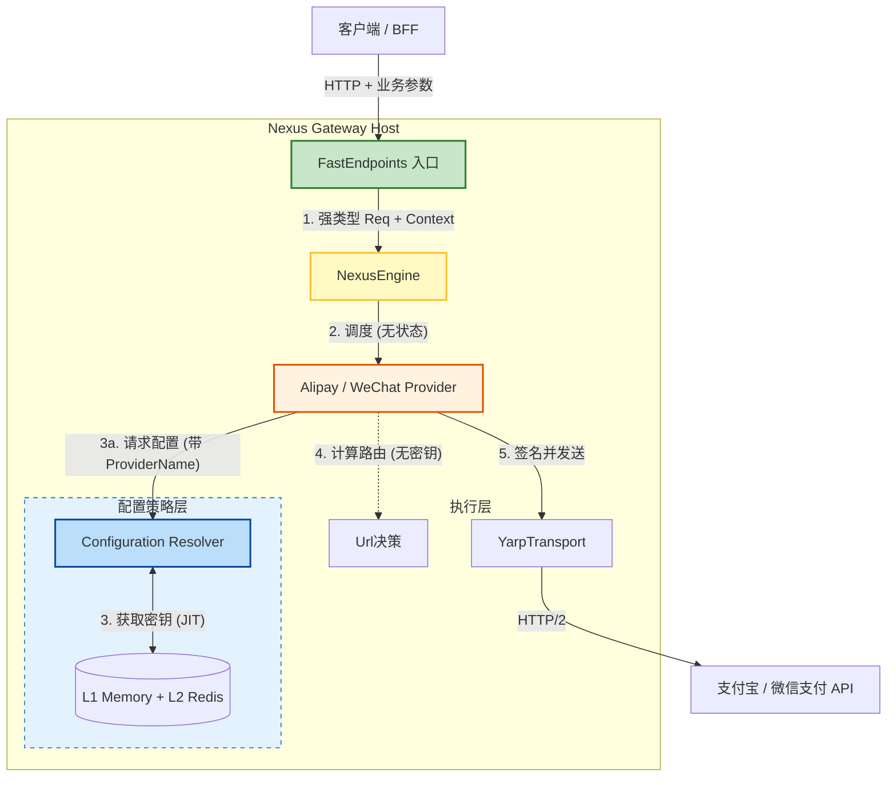
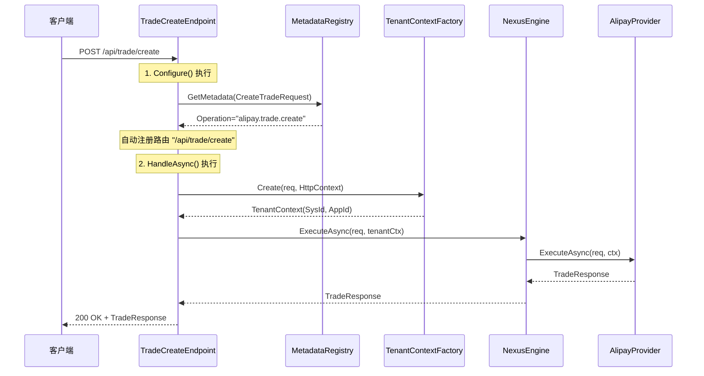

# 🏛️ NexusContract 架构蓝图 v1.2 (Final Execution Release)

> **版本:** 1.2 (ISV 多商户执行版)
> **状态:** ✅ 已批准 (Approved)
> **日期:** 2026年1月10日
> **场景:** 面向支付宝/微信支付的高并发 ISV 服务商网关 (上百商户动态接入)
> **技术约束:** 核心契约兼容 .NET Standard 2.0 (WinForm/Legacy 支持)

## 1. 架构总览 (Architectural Overview)

本架构遵循 **“接收 (Ingress) -> 调度 (Dispatcher) -> 动态配置 (JIT Resolver) -> 执行 (Executor)”** 的流水线模型。

### 核心组件职责

| 组件 | 层级 | 隐喻角色 | 职责描述 | 关键特性 |
| --- | --- | --- | --- | --- |
| **FastEndpoints** | **入口** | **收件人** | 哑终端。负责元数据路由、异常归一化、租户上下文提取。 | 🟢 **Metadata Zero-Code** |
| **NexusEngine** | **核心** | **调度员** | 大脑。根据 Request 类型分发至对应的 Provider。 | 🟡 **无状态调度** |
| **ConfigResolver** | **策略** | **管家** | **新引入**。负责将业务身份 (Realm/Profile) 映射为物理配置。 | 🔵 **JIT 动态加载** |
| **Provider** | **业务** | **专家** | 无状态单例。仅负责签名与协议转换，不持有静态配置。 | 🟡 **环境隔离** |
| **YarpTransport** | **出口** | **车队** | 高性能 HTTP/2 连接池隧道。 | 🔴 **多路复用** |

---

## 2. 物理架构与数据流 (Physical Architecture)



---

## 3. 核心契约 (`NexusContract.Abstractions`)

**技术约束：** 目标框架 **.NET Standard 2.0**。严禁使用 `record`, `required`, `init`。

### A. 配置上下文 (ConfigurationContext)

```csharp
namespace NexusContract.Abstractions;

public class ConfigurationContext
{
    // 强制构造函数校验
    public ConfigurationContext(string providerName, string realmId)
    {
        if (string.IsNullOrEmpty(providerName)) throw new ArgumentNullException(nameof(providerName));
        if (string.IsNullOrEmpty(realmId)) throw new ArgumentNullException(nameof(realmId));

        ProviderName = providerName;
        RealmId = realmId;
    }

    /// <summary>渠道标识 (e.g. "Alipay")</summary>
    public string ProviderName { get; private set; }

    /// <summary>域/归属权 (对应 SysId / SpMchId)</summary>
    public string RealmId { get; private set; }

    /// <summary>档案/执行单元 (对应 AppId / SubMchId)</summary>
    public string ProfileId { get; set; }

    public Dictionary<string, object> Metadata { get; set; }
}

```

### B. 路由上下文 (RoutingContext) - **安全隔离**

```csharp
public class RoutingContext
{
    public RoutingContext(Uri baseUrl)
    {
        if (baseUrl == null) throw new ArgumentNullException(nameof(baseUrl));
        BaseUrl = baseUrl;
    }

    public Uri BaseUrl { get; private set; }
    public string Version { get; set; }
}

public interface IUpstreamUrlBuilder
{
    // ✅ 修正：只接收纯净的 Context，不接收含私钥的 Settings
    Uri Build(string operationId, RoutingContext context);
}

```

---

## 4. 关键实现策略 (Implementation)

### A. 入口层：零代码与元数据驱动 (Zero-Code Ingress)

采用 **模板方法模式**。基类接管路由、租户提取、引擎调度和 **NxcErrorEnvelope** 封装。

#### 🔧 框架基类实现 (Framework Base Class)

```csharp
// 核心基类：NexusEndpointBase
// 🔥 关键设计：仅需传入 TReq，框架自动从 IApiRequest<TResp> 推断响应类型
public abstract class NexusEndpointBase<TReq> : Endpoint<TReq, TReq.TResponse>
    where TReq : class, IApiRequest<TReq.TResponse>, new()
{
    private readonly INexusEngine _engine; // 替换具体的 Provider，实现通用调度
    private readonly ILogger _logger;

    protected NexusEndpointBase(INexusEngine engine, ILogger logger)
    {
        _engine = engine;
        _logger = logger;
    }

    public override void Configure()
    {
        // 1. [Zero-Code] 基于 [ApiOperation] 元数据自动生成路由
        var metadata = NexusContractMetadataRegistry.Instance.GetMetadata(typeof(TReq));
        
        if (metadata?.Operation == null)
            throw new InvalidOperationException($"Missing [ApiOperation] on {typeof(TReq).Name}");

        // e.g., "nexus.trade.create" -> "/api/trade/create"
        string route = RouteStrategy.Convert(metadata.Operation.OperationId); 
        
        Post(route);
        AllowAnonymous();
    }

    public override async Task HandleAsync(TReq req, CancellationToken ct)
    {
        try
        {
            // 2. [ISV Feature] 自动提取租户上下文 (SysId/AppId)
            var tenantCtx = TenantContextFactory.Create(req, HttpContext);

            // 3. [Dispatcher] 委托给引擎调度
            var response = await _engine.ExecuteAsync(req, tenantCtx, ct);
            
            await SendAsync(response);
        }
        // 4. [Error Normalization] 统一错误契约 (NxcErrorEnvelope)
        catch (ContractIncompleteException ex)
        {
            await SendEnvelopeAsync(400, "NXC200", ex.Message, ex.GetDiagnosticData(), ct);
        }
        catch (NexusTenantException ex) // 租户解析失败
        {
            await SendEnvelopeAsync(403, "TENANT_INVALID", ex.Message, null, ct);
        }
        catch (Exception ex)
        {
            _logger.LogError(ex, "Gateway Error");
            await SendEnvelopeAsync(500, "NXC999", "Internal Server Error", null, ct);
        }
    }
}

```

#### 🚀 业务 Endpoint 实现示例 (Zero-Code in Action)

**传统方式 vs NexusContract 方式对比：**

```csharp
// ❌ 传统方式：每个 Endpoint 都需要大量样板代码 (70+ 行)
// 注意：即使是传统方式，也需要显式指定 TradeResponse
public class TradeCreateEndpoint_Traditional : Endpoint<CreateTradeRequest, TradeResponse>
{
    private readonly IAlipayProvider _alipayProvider;
    private readonly ILogger<TradeCreateEndpoint_Traditional> _logger;

    public TradeCreateEndpoint_Traditional(IAlipayProvider alipayProvider, ILogger<...> logger)
    {
        _alipayProvider = alipayProvider;
        _logger = logger;
    }

    public override void Configure()
    {
        Post("/api/alipay/trade/create");  // 硬编码路由
        AllowAnonymous();
    }

    public override async Task HandleAsync(CreateTradeRequest req, CancellationToken ct)
    {
        try
        {
            // 手动提取租户信息
            var sysId = HttpContext.Request.Headers["X-SysId"].ToString();
            var appId = req.AppId ?? HttpContext.Request.Headers["X-AppId"].ToString();
            
            if (string.IsNullOrEmpty(sysId) || string.IsNullOrEmpty(appId))
                throw new ArgumentException("缺少租户标识");

            // 手动调用 Provider
            var response = await _alipayProvider.ExecuteAsync(req, ct);
            await SendAsync(response);
        }
        // 手动异常处理
        catch (ContractIncompleteException ex)
        {
            await SendAsync(new ErrorResponse 
            { 
                Code = "NXC200", 
                Message = ex.Message 
            }, 400);
        }
        catch (Exception ex)
        {
            _logger.LogError(ex, "支付宝交易创建失败");
            await SendAsync(new ErrorResponse 
            { 
                Code = "NXC999", 
                Message = "Internal Server Error" 
            }, 500);
        }
    }
}

// ✅ NexusContract 方式：极致简洁，真正的零代码 (1 行！)
// 🔥 关键：无需指定响应类型！框架从 IApiRequest<TradeResponse> 自动推断
// 💎 .NET 10 特性：主构造函数（Primary Constructor）彻底消除构造函数样板
public sealed class TradeCreateEndpoint(INexusEngine engine) 
    : NexusEndpointBase<CreateTradeRequest>(engine) { }

// ✅ 同样适用于其他所有 Endpoint - 响应类型由契约接口决定
public sealed class TradePayEndpoint(INexusEngine engine) 
    : NexusEndpointBase<TradePayRequest>(engine) { }

public sealed class TradeQueryEndpoint(INexusEngine engine) 
    : NexusEndpointBase<TradeQueryRequest>(engine) { }

public sealed class TradeRefundEndpoint(INexusEngine engine) 
    : NexusEndpointBase<TradeRefundRequest>(engine) { }

// ✅ 跨渠道一致性：微信支付 Endpoint 结构完全相同  此处只是举例 一般HostApi不会同时存在两类三方
public sealed class WeChatPayEndpoint(INexusEngine engine) 
    : NexusEndpointBase<WeChatPayRequest>(engine) { }

```

#### 🎯 框架先进性体现 (Key Advantages)

| 维度 | 传统方式 | NexusContract | 优势 |
|------|---------|---------------|------|
| **代码量** | 每个 Endpoint 70+ 行 | 每个 Endpoint 1 行 (.NET 10) | **99% 代码削减** |
| **路由配置** | 硬编码字符串 | 元数据自动生成 | 零硬编码，类型安全 |
| **租户提取** | 手动解析 Header/Body | 自动识别与提取 | 框架自动处理 |
| **异常处理** | 每个 Endpoint 重复 | 基类统一处理 | 全局一致性 |
| **错误格式** | 自定义 ErrorResponse | 标准 NxcErrorEnvelope | 契约规范化 |
| **可测试性** | 需 Mock HttpContext | 纯 POCO 单元测试 | 无基础设施依赖 |
| **新增 API** | 复制粘贴 70 行模板 | 1 行即可完成 | **70 倍开发效率** |
| **跨渠道一致** | 每个渠道定制实现 | 完全统一结构 | 降低认知负担 |

#### 💡 实际运行效果

当请求 `POST /api/trade/create` 时，框架自动完成：



#### 🔥 开发者体验 (Developer Experience)

```csharp
// 1️⃣ 定义契约 (在 NexusContract.Abstractions 中)
// 🔥 核心：IApiRequest<TradeResponse> 已经声明了响应类型
// 📋 规范：使用 [ApiField] 精确控制字段映射（如 snake_case）、加密标记、必填约束等
[ApiOperation("alipay.trade.create", HttpVerb.POST)]
public class CreateTradeRequest : IApiRequest<TradeResponse>
{
    [ApiField("out_trade_no", IsRequired = true, Description = "商户订单号")]
    public string OutTradeNo { get; set; }
    
    [ApiField("total_amount", IsRequired = true, Description = "订单总金额，单位：元")]
    public decimal TotalAmount { get; set; }
    
    [ApiField("subject", IsRequired = true, Description = "订单标题")]
    public string Subject { get; set; }
}

// 2️⃣ 创建 Endpoint (在网关项目中) - 仅需 1 行！
// 🔥 灵魂设计：无需重复指定 TradeResponse，框架从契约接口自动推断
// 💎 .NET 10 特性：主构造函数（Primary Constructor）让代码极致简洁
// ⚠️ 关键：Endpoint 内部完全为空，无任何业务逻辑
public sealed class TradeCreateEndpoint(INexusEngine engine) 
    : NexusEndpointBase<CreateTradeRequest>(engine) { }

// 完整注释版本（实际开发可加 XML 文档注释）：
/// <summary>交易创建接口 - 契约: [ApiOperation("alipay.trade.create")]</summary>
public sealed class TradeCreateEndpoint(INexusEngine engine) 
    : NexusEndpointBase<CreateTradeRequest>(engine) { }

// 3️⃣ 完成！无需任何额外配置
// ✅ 路由自动生成：/api/trade/create
// ✅ 租户自动提取：SysId、AppId
// ✅ 引擎自动调度：路由到 AlipayProvider
// ✅ 响应自动返回：await SendAsync(response) 由基类完成
// ✅ 异常自动归一：NxcErrorEnvelope 全局统一
// ✅ 日志自动记录：OperationId、TenantId
```

**这就是 NexusContract 的先进性：结合 .NET 10 主构造函数特性，让 99% 的样板代码消失，Endpoint 变成纯粹的类型声明（1行代码），开发者只需关注业务契约。**

### B. 基础设施：ISV 混合解析器 (Infrastructure)

负责将“业务方言”映射为“框架标准”。

```csharp
public class HybridConfigResolver : IConfigurationResolver
{
    private readonly ITenantRepository _repo; 

    public async Task<ProviderSettings> ResolveAsync(ConfigurationContext ctx, CancellationToken ct)
    {
        // 1. 术语映射: RealmId -> SysId, ProfileId -> InnerAppId
        // 2. L1/L2 缓存查找
        var config = await _repo.GetAsync(ctx.ProviderName, ctx.RealmId, ctx.ProfileId);
        
        if (config == null) throw new NexusTenantException("无效商户配置");
        return config;
    }
}

```

### C. 业务层：无状态 Provider (Provider)

Provider 内部写死 `ProviderName`，并在运行时动态加载配置。

```csharp
public class AlipayProvider(IConfigurationResolver _resolver, ...) : IProvider
{
    private const string NAME = "Alipay"; 

    public async Task<TResponse> ExecuteAsync(IApiRequest request, NexusContext ctx)
    {
        // 1. 构造上下文
        var configCtx = new ConfigurationContext(NAME, ctx.Metadata["SysId"]) 
        { 
            ProfileId = ctx.Metadata["AppId"] 
        };

        // 2. JIT 加载配置
        var settings = await _resolver.ResolveAsync(configCtx, CancellationToken.None);

        // 3. 签名 (仅此处使用私钥)
        var targetUri = _urlBuilder.Build(request.GetOperationId(), new RoutingContext(settings.GatewayUrl));
        var httpRequest = _signer.SignRequest(request, targetUri, settings); 

        return await _transport.SendAsync(httpRequest, ctx);
    }
}

```

---

## 5. 组合根 (Program.cs)

```csharp
var builder = WebApplication.CreateBuilder(args);

// 1. 核心与入口
builder.Services.AddFastEndpoints();
builder.Services.AddNexusContract();

// 2. ISV 解析器与仓储
builder.Services.AddSingleton<IConfigurationResolver, HybridConfigResolver>();
builder.Services.AddSingleton<ITenantRepository, RedisTenantRepository>();

// 3. 注册 Providers
builder.Services.AddSingleton<IProvider, AlipayProvider>();
builder.Services.AddSingleton<IProvider, WeChatProvider>();

// 4. 生产环境出口 (YARP)
if (builder.Environment.IsProduction())
{
    builder.Services.AddNexusYarpHosting();
}

var app = builder.Build();
app.UseFastEndpoints();
app.Run();

```

---

## 6. 关键架构决策记录 (ADR Summary)

### 基础架构 (继承自 v1.0)

* **ADR-001: 入口/出口分离 (Ingress/Egress Separation)**
* **FastEndpoints** 处理入口 (API 定义)，**YARP** 处理出口 (HTTP/2 传输)。


* **ADR-002: 客户端纯净性 (Client Purity)**
* `NexusContract.Client` SDK 必须保持零依赖，不得引用 FastEndpoints 或 YARP。


* **ADR-003: 确定性签名 (Deterministic Signing)**
* URL 解析必须在 Provider 内部、签名之前完成。


### ISV 增强架构 (v1.2 新增)

* **ADR-004: 动态配置 (JIT Configuration)**
* **变更:** 废弃静态 `IOptions` 单例注入。
* **决策:** 采用 `IConfigurationResolver` 配合 L1/L2 缓存。
* **理由:** 支持上百商户动态接入，且配置更新不应重启服务。


* **ADR-005: 领域与档案 (Realm & Profile)**
* **决策:** 框架层抽象为 `RealmId` (域) 和 `ProfileId` (档案)。
* **理由:** 同时兼容支付宝 (AppId体系) 和微信支付 (服务商体系)，消除 `SysId` 等业务术语污染。


* **ADR-006: 上下文隔离 (Context Isolation)**
* **决策:** `ProviderSettings` (含私钥) 严禁传给 URL Builder。
* **理由:** 最小权限原则，防止 URL 策略层无意泄露密钥。


* **ADR-007: 兼容性降级 (Compatibility)**
* **决策:** `NexusContract.Abstractions` 必须兼容 **.NET Standard 2.0**。
* **理由:** 支持企业内部 WinForm 和遗留 .NET Framework 系统的接入。禁止使用 `record`, `required`。