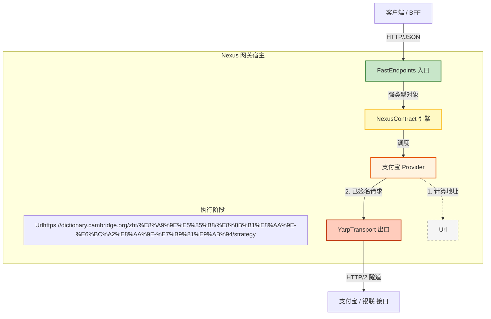

# 🏛️ NexusContract 架构蓝图 v1.0

> **版本:** 1.0 (最终定稿)
> **状态:** ✅ 已批准
> **日期:** 2026年1月10日
> **范围:** 端到端高性能网关架构

## 1. 架构总览 (Architectural Overview)

本架构遵循严格的 **“接收-调度-运输”** 流程，完美整合了 **FastEndpoints** (入口)、**NexusContract** (逻辑) 和 **YARP** (出口)。

### 组件角色与职责

| 组件 | 层级 | 隐喻角色 | 职责描述 | 依赖范围 |
| --- | --- | --- | --- | --- |
| **FastEndpoints** | **入口层 (Ingress)** | **收件柜台** | **对外窗口。** 负责接收 HTTP 请求、身份验证，并调用 Nexus 引擎。 | 🟢 **表示层** |
| **NexusContract.Core** | **引擎层 (Engine)** | **调度中心** | **处理核心。** 负责契约校验、管道编排，并调度具体的 Provider。 | 🟡 **核心逻辑** |
| **NexusContract.Providers** | **适配层 (Adapter)** | **打包专员** | **业务逻辑。** 封装厂商特定逻辑（签名、加密）并映射协议。 | 🟡 **业务逻辑** |
| **NexusContract.Hosting.Yarp** | **出口层 (Egress)** | **重卡车队** | **对外运输。** 通过高性能 HTTP/2 隧道将请求发送给上游机构。 | 🔴 **基础设施** |

---

## 2. 物理架构与数据流 (Physical Architecture)

架构强制执行从入口到出口的单向数据流。



---

## 3. 核心抽象 (`NexusContract.Abstractions`)

这些接口将 **“业务意图”** 与 **“物理执行”** 解耦。

### A. 传输层抽象 (`INexusTransport`)

将 Provider 与底层的 HTTP 客户端实现解耦。

```csharp
namespace NexusContract.Transports;

public interface INexusTransport
{
    /// <summary>
    /// 异步发送 HTTP 请求。
    /// </summary>
    /// <param name="request">已签名的 HttpRequestMessage。</param>
    /// <param name="context">包含元数据（重试策略、超时、追踪 ID）的上下文。</param>
    Task<HttpResponseMessage> SendAsync(
        HttpRequestMessage request, 
        NexusContext context, 
        CancellationToken ct = default);
}

```

### B. 路由策略 (`IUpstreamUrlBuilder`)

将“逻辑操作 ID”与“物理 URL”解耦，确保签名的确定性。

```csharp
namespace NexusContract.Routing;

public interface IUpstreamUrlBuilder
{
    /// <summary>
    /// 根据操作 ID 解析物理上游 URI。
    /// 例如: "alipay.trade.pay" -> "https://openapi.alipay.com/v3/pay"
    /// </summary>
    Uri Build(string operationId, ProviderSettings settings);
}

```

---

## 4. 实现策略 (Implementation Strategy)

### A. 入口层 (FastEndpoints)

作为 NexusContract 的宿主，处理初始请求的接收。

```csharp
public class CreateTradeEndpoint : Endpoint<CreateTradeRequest, TradeResponse>
{
    public INexusEngine _engine { get; set; } // 注入核心引擎

    public override void Configure()
    {
        Post("/api/trade/create");
        AllowAnonymous();
    }

    public override async Task HandleAsync(CreateTradeRequest req, CancellationToken ct)
    {
        // 1. 接收 (Ingress): FastEndpoints 将 JSON 绑定为 POCO
        
        // 2. 调度 (Dispatch): Nexus 引擎找到 Provider -> 签名 -> 发送
        var result = await _engine.ExecuteAsync(req, ct);

        // 3. 响应 (Response): 返回标准化结果
        await SendAsync(result);
    }
}

```

### B. 业务层 (Provider)

Provider 专注于协议映射和安全性。

```csharp
public class AlipayProvider(
    INexusTransport _transport,     // 注入项：YarpTransport 或 HttpClientTransport
    IUpstreamUrlBuilder _urlBuilder // 注入项：RPC 或 REST V3 策略
) : IProvider
{
    public async Task<TResponse> ExecuteAsync<TResponse>(IApiRequest<TResponse> request, NexusContext ctx)
    {
        // 1. 寻址 (Addressing): 在签名之前解析物理 URL
        var targetUri = _urlBuilder.Build(request.GetOperationId(), _settings);

        // 2. 签名 (Signing): 对【确定的 URL】和 Body 进行签名
        var httpRequest = _signer.SignRequest(request, targetUri);

        // 3. 传输 (Transport): 委托给基础设施层
        var response = await _transport.SendAsync(httpRequest, ctx);

        return await _hydrator.HydrateAsync<TResponse>(response);
    }
}

```

### C. 基础设施层 (传输对比)

| 特性 | 默认传输 (`NexusContract.Core`) | 高性能传输 (`NexusContract.Hosting.Yarp`) |
| --- | --- | --- |
| **基础技术** | `System.Net.Http.HttpClient` | `Yarp.ReverseProxy.Forwarder` |
| **适用场景** | 开发、功能测试 | 生产环境、高并发 |
| **连接池** | 标准 `SocketsHttpHandler` | 激进复用、主动健康检查 |
| **多路复用** | 标准支持 | **HTTP/2 & HTTP/3 多路复用** |
| **配置方式** | 内置 (零配置) | 需显式启用 (`.UseYarpTransport()`) |

---

## 5. 组合根 (Program.cs)

使用 .NET 依赖注入将所有组件串联。

```csharp
var builder = WebApplication.CreateBuilder(args);

// 1. 入口 (Ingress): 添加 FastEndpoints
builder.Services.AddFastEndpoints();

// 2. 逻辑 (Logic): 添加 NexusContract & Providers
builder.Services.AddNexusContract(options =>
{
    options.AddAlipay(alipay => 
    {
        // 策略: 使用 REST V3 接口
        alipay.UseUrlStrategy<RestV3UrlBuilder>();
        alipay.AppId = builder.Configuration["Alipay:AppId"];
    });
});

// 3. 出口 (Egress): 添加 YARP (仅生产环境)
if (builder.Environment.IsProduction())
{
    // 将默认传输层替换为 YARP 实现
    builder.Services.AddNexusYarpHosting(config => 
    {
        config.MaxConnectionsPerServer = 1000;
        config.EnableHttp2 = true;
    });
}

var app = builder.Build();

// 4. 启动管道
app.UseFastEndpoints();
app.Run();

```

---

## 6. 关键架构决策 (ADR 摘要)

* **ADR-001: 入口/出口分离 (Ingress/Egress Separation)**
* **FastEndpoints** 处理入口 (客户端 -> 网关)。
* **YARP** 处理出口 (网关 -> 上游)。


* **ADR-002: 客户端纯净性 (Client Purity)**
* `NexusContract.Client` SDK 对 YARP 或 Core 逻辑零依赖。


* **ADR-003: 确定性签名 (Deterministic Signing)**
* URL 解析 (`IUpstreamUrlBuilder`) 必须在 Provider 逻辑内部、签名**之前**发生，以防止签名不匹配。